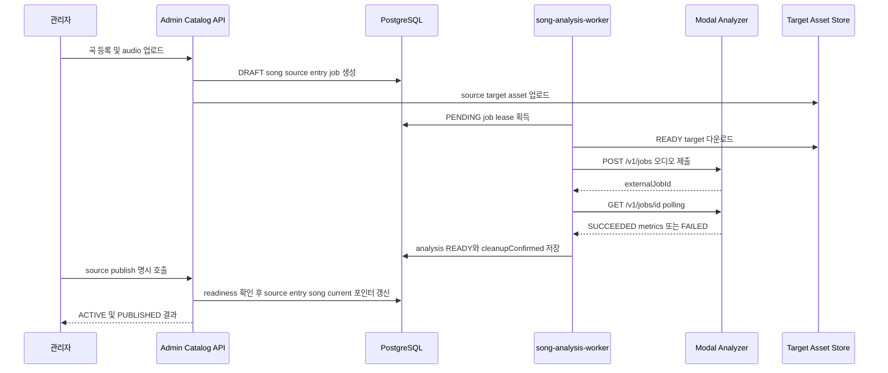

# Song catalog analysis and publication workflow

이 워크플로의 기준은 `TJ_2607_CATALOG_SLUG` 카탈로그입니다. 관리자 API는 모두 `requireAdminApi`를 거치므로 관리자 세션 없이 등록·재시도·공개할 수 없습니다. 구현상 **곡(song)**, **출처(source revision)**, **분석(analysis revision)**, **target asset**, **카탈로그 항목(entry)**은 서로 다른 레코드이며, 어느 하나를 다른 하나의 대용어로 취급하면 안 됩니다.

## 핵심 데이터와 상태

- **곡**: 제목·가수의 유일한 도메인 레코드입니다. `lifecycleStatus`는 `DRAFT`, `ACTIVE`, `ARCHIVED`이며, 현재 선택을 가리키는 `activeSourceId`, `currentAnalysisId`, `targetAssetId`를 별도로 보유합니다.
- **source revision**: 곡의 원본 YouTube URL/11자리 `sourceVideoId`/라벨을 담는 `SongSource`입니다. 새 출처 교체는 기존 행을 수정하지 않고 `revision`을 1 증가시킨 새 행과 새 분석 작업을 만듭니다. 공개 시 이전 `READY` 출처는 `SUPERSEDED`가 됩니다.
- **analysis revision**: `SongAnalysis`는 `(sourceId, pipelineContract)`별로 저장됩니다. MIDI 범위·tessitura·유성 비율·pitch stability·clipping·RMS·추정 조성 및 analyzer 버전 등을 보유하고, 작업 성공과 별개로 `status=READY` 및 `cleanupConfirmed=true`여야 현재 분석으로 사용할 수 있습니다.
- **target asset**: 분석기에 넘길 실제 오디오 파일의 외부 저장소 자산입니다. `externalProjectId`, `externalFileId`, URL, 파일 해시와 `sourceId`/`sourceVideoId`를 저장하지만 원본 바이트 자체는 DB에 저장하지 않습니다. 상태는 `READY`, `DELETE_PENDING`, `DELETED`, `FAILED`입니다.
- **catalog entry**: 곡을 카탈로그의 위치(`position`)에 연결하는 공개 단위입니다. `DRAFT`, `PUBLISHED`, `ARCHIVED` 상태와 `publishedAt`을 가지며, 공개 결과가 바뀌면 카탈로그 `revision`이 증가합니다.

위 시퀀스는 등록부터 분석, 그리고 자동이 아닌 **명시적 공개**까지의 경계를 보여줍니다.

## 1. 등록과 source 교체

`POST /api/admin/catalog`은 multipart `title`, `artist`, `sourceUrl`, `idempotencyKey`, `audio`를 받습니다. 카탈로그가 먼저 존재해야 하며, 새 곡은 `DRAFT` song, revision 1의 `DRAFT` source, `DRAFT` entry, `PENDING` `SongAnalysisJob`으로 하나의 트랜잭션에서 만들어집니다. 위치를 주지 않으면 마지막 위치 다음을 사용합니다. idempotency key가 재사용되면 같은 곡·출처 요청은 기존 결과를 반환하고, 다른 내용이면 conflict입니다.

`POST /api/admin/catalog/[songId]/sources`는 기존 곡의 새 source revision을 생성합니다. 따라서 새 URL을 등록했다고 이전 source가 곧바로 active가 되거나 추천 대상이 되지 않습니다. 각 등록/교체 뒤 `POST /api/admin/catalog/sources/[sourceId]/target`으로 target asset을 업로드하거나, 곡 생성·교체 API의 multipart 업로드를 사용합니다. 저장소 업로드는 비어 있지 않은 파일, 지원 확장자, 크기와 WAV RIFF 헤더를 검사하고 SHA-256을 기록합니다. 이전 target이 더 이상 참조되지 않으면 외부 삭제를 시도하며, 실패 시 `DELETE_PENDING`으로 남겨 운영자가 정리할 수 있습니다.

## 2. 분석 작업과 Modal 경계

`node scripts/song-analysis-worker.ts`는 여러 lane을 실행하는 장기 프로세스입니다. worker는 PostgreSQL에서 `FOR UPDATE SKIP LOCKED`로 오래된 작업을 하나씩 claim하고 lease/heartbeat를 갱신합니다. `READY` target이 없는 작업은 claim하지 않습니다. lease가 만료된 `PROCESSING` 작업은 다시 선택될 수 있어 다중 worker에서도 중복 claim을 피합니다.

worker는 target URL을 내려받아 `POST {analyzerUrl}/v1/jobs`에 `X-API-Key`, `requestId`, `sourceVideoId`, 오디오 파일을 보냅니다. Modal 응답의 `externalJobId`를 DB에 저장하고 `GET /v1/jobs/{id}`를 polling합니다. `PROCESSING`은 계속 기다리고, 성공하면 분석 지표와 메타데이터를 트랜잭션으로 upsert하여 `READY`로 만들며 정리 확인을 true로 기록합니다. 타임아웃·네트워크·Modal 결과 만료 등은 오류 코드와 retryable 여부로 정규화됩니다. retryable이고 최대 시도 횟수 전이면 exponential backoff의 `PENDING`, 아니면 작업과 분석을 `FAILED`로 남깁니다. 관리자 재시도 endpoint는 실패한 작업만 `PENDING`으로 되돌립니다.

Modal의 `/v1/jobs`는 API key, request id, YouTube ID, 비어 있지 않은 100 MB 이하 오디오와 확장자를 검사합니다. 실제 함수는 임시 파일을 WAV로 변환하고 Demucs `htdemucs`로 vocal stem을 분리한 뒤 `vocal-analysis-core`의 분석을 실행합니다. 조성 추정에는 librosa chroma가 사용됩니다. 임시 디렉터리가 사라지고 `cleanupConfirmed`가 true인지 확인하지 못하면 실패합니다. 즉 Modal은 계산 경계이고, 현재 분석의 소유권과 공개 판정은 애플리케이션 DB/관리자 서비스에 있습니다.

## 3. readiness와 명시적 publication

관리자 화면의 `POST /api/admin/catalog/[songId]/sources/[sourceId]/publish`가 유일한 source 공개 동작입니다. `publishAdminSongSource`는 다음을 모두 확인합니다.

1. song에 해당 source가 존재한다.
2. 현재 pipeline contract의 analysis가 `READY`이고 `cleanupConfirmed=true`다.
3. 같은 source에 연결된 최신 `READY` target이 있고 target의 `sourceVideoId`가 source와 같다.
4. 해당 카탈로그 entry가 존재한다.

그 후 기존 `READY` source는 `SUPERSEDED`, 선택 source는 `READY`, entry는 `PUBLISHED`, song은 `ACTIVE`가 됩니다. song의 `activeSourceId`, `currentAnalysisId`, `targetAssetId`를 같은 source 계열로 갱신하고 분석의 `estimatedKey`를 원곡 조성으로 반영합니다. 선택이 바뀌면 catalog revision을 증가시키고, 이전 target이 바뀌어 참조되지 않으면 외부 자산을 정리합니다.

공통 `catalogReadiness`는 song이 `ACTIVE`인지, active source가 정확히 `READY`인지, current analysis가 ID·source를 일치시키며 `READY`이고 cleanup을 확인했는지, target이 ID·source를 일치시키며 `READY`인지, entry가 `PUBLISHED`인지 검사합니다. 실패 이유는 `SONG_NOT_ACTIVE`, `SOURCE_NOT_READY`, `ANALYSIS_NOT_READY`, source mismatch, `TARGET_NOT_READY`, target mismatch, `CATALOG_ENTRY_NOT_PUBLISHED`로 구분됩니다. 따라서 분석이 끝났거나 파일이 업로드됐다는 사실만으로는 recommendable하지 않습니다.

## 4. snapshot export/import

`GET /api/admin/catalog/export`는 먼저 공개 행 전체를 readiness와 위치 중복까지 검증합니다. 불완전하거나 invalid 행이 있으면 export하지 않습니다. 성공한 snapshot은 schema version 3, 카탈로그 slug/name/issue/revision, 생성 시각, 각 곡의 source 메타데이터, 분석 결과·지표·pipeline metadata, target asset의 외부 식별자·URL·파일명·MIME·크기·SHA-256을 담습니다.

snapshot은 **메타데이터와 분석 증거**이지 embedded original audio bytes가 아닙니다. export 시 `audioBytes`, `base64`, 임시/스토리지 경로 같은 키를 제거하고 pipeline metadata도 allowlist로 제한합니다. import도 schema와 HTTPS YouTube URL 및 source ID 일치를 검증하며, 위치·곡·source video ID·외부 target 중복과 target-source 불일치를 거부합니다. import는 트랜잭션으로 song/source/analysis/target/entry를 upsert하고 준비된 행은 `ACTIVE`/`PUBLISHED`로 복원합니다. 같은 snapshot 재실행은 멱등적이며 기존 catalog revision을 낮추지 않습니다. 원본 파일을 실제로 복원하려면 snapshot과 별도로 승인된 target 파일을 외부 저장소에 업로드해야 합니다.

## 5. 공개 카탈로그의 소비자

추천 결과 생성은 `status=PUBLISHED` 카탈로그를 찾은 뒤 Repeatable Read 트랜잭션 안에서 `loadPublishedCatalog`를 호출합니다. 이 조회는 공개 entry뿐 아니라 공개 catalog, `ACTIVE` song, `READY` active source, `READY` current analysis와 cleanup 확인, `READY` target을 함께 요구하고 position 순으로 반환합니다. 이후 분석 지표를 vocal profile과 비교해 순위를 계산하고, 결과에는 analysis ID·target asset ID·추천 shift·지표가 포함됩니다. 공개 카탈로그가 없거나 순위를 계산할 수 없으면 `CATALOG_NOT_READY`로 처리되므로 draft나 부분 분석은 사용자 추천에 노출되지 않습니다.

추천 결과의 mixing 상태는 같은 `songAnalysisId`로 사용자의 mixing job을 연결합니다. 실제 mixing 요청은 추천된 analysis와 target asset을 사용하며, target은 원본 source와의 일치를 유지해야 합니다. mixing 결과 자산이 `READY`일 때만 결과 audio URL을 반환합니다. 따라서 publication은 단순 UI 플래그가 아니라 추천 후보의 분석 일관성과 mixing 입력 자산의 안전한 기준점을 만드는 DB 경계입니다.

## 운영 점검과 대표 테스트

- 관리자 목록 `GET /api/admin/catalog?q=&status=&page=`로 source/analysis/target/entry 상태를 확인하고, 실패 job만 retry합니다.
- 공개 전 `catalogReadiness`의 모든 reason을 확인합니다. 특히 새 source 교체 후 이전 analysis나 target을 current 포인터로 재사용하지 않습니다.
- Modal URL/API key 설정, worker lease 만료, target 외부 URL 접근성, `DELETE_PENDING` 자산을 모니터링합니다.
- `tests/admin-song-catalog.integration.ts`는 관리자 등록, idempotency, source revision, readiness와 publication/archival을 검증합니다.
- `tests/catalog-target-assets.integration.ts`는 source-video 일치, 파일 검증·해시·외부 자산 교체/정리를 검증합니다.
- `tests/catalog-snapshot.integration.ts`는 새 DB 복원과 멱등성, revision 하향 방지, raw bytes 금지, metadata allowlist, URL/중복/target mismatch 거부를 검증합니다.
- `tests/song-catalog-domain.test.ts`는 readiness reason과 공개 가능 조건을 도메인 단위로 고정합니다.
