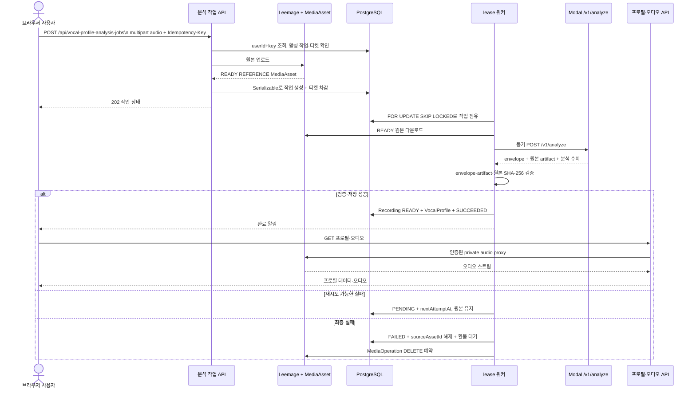
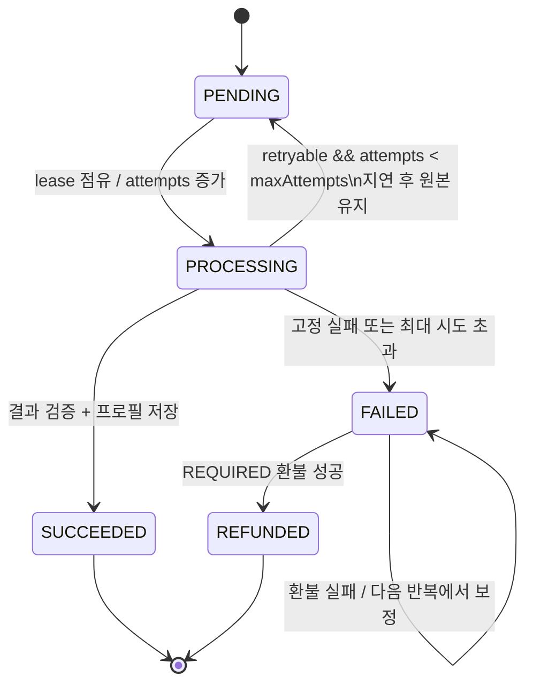

## 먼저 알아둘 결론

녹음은 요청에서 바로 프로필이 되지 않아요. 인증된 API가 `audio`를 검증하고 Leemage에 원본을 올린 뒤 `REFERENCE` `MediaAsset`과 `VocalProfileAnalysisJob`을 만들어요. 워커가 작업의 lease(임대 소유권)를 얻어 원본을 내려받고 Modal의 `/v1/analyze`를 동기로 호출해요. 응답의 원본 무결성과 envelope를 확인한 뒤 `Recording`과 `VocalProfile`을 저장하고, 작업과 알림을 완료 상태로 바꿔요.

독자가 확인할 핵심 질문은 **녹음이 어떻게 분석 작업과 보컬 프로필 결과가 되고 실패·삭제 경쟁에서 안전하게 유지되나요?**예요. 구현을 바꿀 때는 먼저 [`analysis-queue.ts`의 등록 경계](repo://src/features/analyze-vocal-profile/api/analysis-queue.ts#L96-L195)와 [`worker.ts`의 점유·실행·실패 수명 주기](repo://src/_app/background-jobs/vocal-profile-analysis/worker.ts#L47-L83)를 읽고, 프로필의 다른 소비자는 [추천·카탈로그 작업](recommendations-and-catalog.md), 운영값은 [운영 설정](../operations/configuration-and-runtime.md)에서 이어서 확인하세요.

## 업로드부터 프로필 조회까지

큐는 같은 사용자의 `PENDING` 또는 `PROCESSING` 작업을 하나만 허용해요. 같은 사용자와 같은 `Idempotency-Key`를 다시 보내면 기존 작업을 202로 돌려주고 새 업로드나 티켓 차감을 하지 않아요. 키가 다르더라도 활성 작업이 있으면 `ANALYSIS_BUSY`와 429를 반환해요. 이 규칙은 이미 프로필이 몇 개 있는지와는 별개예요.

### 요청과 큐 등록

`POST /api/vocal-profile-analysis-jobs`는 인증 세션, `Idempotency-Key`, `audio` multipart 파일을 요구해요. 요청 본문과 파일은 25 MiB 이하이고 WAV·MP3·M4A·WebM만 허용해요. 잘못된 키는 400, 지원하지 않는 오디오는 415, 크기 초과는 413, 티켓 부족은 402로 응답해요. 인증되지 않은 요청은 먼저 거절돼요. 자세한 응답 매핑은 [`vocal-profile-analysis-jobs-route.ts`](repo://src/_app/api-routes/vocal-profiles/vocal-profile-analysis-jobs-route.ts#L24-L129)에서 확인하세요.

큐 등록 함수는 파일을 Leemage에 먼저 저장해 `READY`인 `REFERENCE` `MediaAsset`을 만들어요. 그 뒤 `Serializable` 트랜잭션에서 입장 잠금과 idempotency 키·활성 작업을 다시 확인하고 작업을 만들며 `VOCAL_ANALYSIS` 티켓을 `USAGE_DEBIT`으로 차감해요. 트랜잭션 충돌은 최대 세 번 다시 시도해요. 경쟁 요청이 먼저 같은 키를 만들면 새로 올린 자산을 폐기하고 기존 작업을 반환해요. 따라서 DB 작업과 티켓 차감이 함께 확정되지 않으면 새 작업으로 보이지 않아요.

### 워커의 lease와 원본 소유권

워커는 실행할 작업을 `FOR UPDATE SKIP LOCKED`로 골라요. `PENDING`이거나 lease가 만료된 `PROCESSING` 작업만 선택하고, `leaseOwner`, `leaseExpiresAt`, `heartbeatAt`을 기록하며 `attempts`를 늘려요. lease가 만료되면 다른 워커가 다시 점유할 수 있어요. 처리 중에는 현재 소유자인지 fence로 확인하므로 늦게 끝난 이전 워커가 새 소유자의 결과를 덮어쓰지 않게 해요.

워커는 `sourceAssetId`가 가리키는 같은 사용자 소유의 `REFERENCE`·`READY` 자산만 읽어요. 자산이 없으면 `ANALYSIS_SOURCE_MISSING` 최종 실패예요. Leemage 다운로드에서 429나 5xx가 나오면 `ANALYSIS_SOURCE_UNAVAILABLE` 재시도 대상으로 분류하고, 그 밖의 다운로드 실패는 같은 방식으로 재시도할 수 있다고 단정하지 않도록 오류 매핑을 확인하세요. 임대 시간·최대 시도 횟수·동시성은 `VOCAL_PROFILE_ANALYSIS_LEASE_SECONDS`, `VOCAL_PROFILE_ANALYSIS_MAX_ATTEMPTS`, `VOCAL_PROFILE_ANALYSIS_WORKER_CONCURRENCY` 설정을 따를 수 있어요.

## Modal 결과를 신뢰하는 경계

워커는 원본을 내려받아 Modal의 `/v1/analyze`에 `X-Recording-ID`와 파일을 보내요. Modal은 recording ID가 UUID인지 확인하고 임시 작업 디렉터리에 파일을 청크로 기록해 분석해요. 분석은 이 호출 안에서 끝나며 `modal-analysis-envelope-v1` envelope를 반환해요. 응답에는 프로필 수치와 원본 artifact가 있고, 필요하면 `synthesisReference` artifact도 있어요. Modal은 임시 디렉터리 정리를 확인한 뒤 `cleanupConfirmed: true`를 설정해요. 결과에는 analyzer와 `analyzerVersion`도 포함돼 저장돼요.

Node 어댑터는 envelope 버전과 cleanup 확인을 요구하고 artifact의 Base64, 크기, SHA-256을 검증해요. `recordingId`, MIME 타입, 크기가 서로 맞는지도 확인해요. 이어 워커가 Modal이 돌려준 source bytes를 큐 원본의 크기·MIME 타입·SHA-256과 다시 비교해요. 이 두 단계가 통과해야 결과를 저장하므로 다른 녹음에 대한 결과나 변조된 artifact를 프로필로 저장하지 않아요. Modal timeout·접속 불가·5xx는 재시도 가능한 오류가 될 수 있지만, 인증 오류나 분석기의 고정 거절은 재시도하지 않는 오류 매핑을 유지하세요.

## `Recording`과 `VocalProfile` 저장

워커는 먼저 같은 사용자와 `recordingId`의 `VocalProfile`이 이미 있는지 확인해요. 있으면 그 프로필을 재사용하고 작업만 성공으로 마무리해요. 새 결과라면 persistence 계층이 다시 `REFERENCE`·`READY` 원본을 확인하고, 필요할 때 `SYNTHESIS_REFERENCE` 자산을 별도로 저장해요. 합성 참고 자산 저장에 실패해도 원본을 fallback으로 남기고 프로필 저장을 계속할 수 있어요.

트랜잭션은 사용자별 프로필 번호를 할당하고 `Recording`을 `USER_TEST`·`READY`로 만들어요. Recording은 큐 등록 때 만든 `MediaAsset`을 연결하고, `VocalProfile`에는 pitch 수치·descriptor·analyzer·`analyzerVersion`을 저장해요. 동시 저장에서 같은 `recordingId`가 먼저 만들어졌다면 기존 행을 읽어 중복 프로필을 만들지 않아요. 저장이 끝나면 작업은 `SUCCEEDED`가 되고 `vocalProfileId`를 가리켜요. 완료 알림의 종류는 `VOCAL_PROFILE_SUCCEEDED`, dedupe key는 `vocal-analysis:{jobId}:succeeded`이며 프로필 경로로 연결돼요.

프로필 오디오는 원본 URL을 브라우저에 직접 노출하는 대신 인증된 `GET /api/vocal-profiles/{id}/audio`가 소유자 범위의 reference를 찾고 private audio proxy를 통해 스트리밍해요. 프로필 데이터 API와 오디오 API가 모두 사용자 소유권을 확인하므로 `externalUrl`만 알아도 다른 사용자의 녹음을 읽을 수 있는 흐름이 아니에요.

## 실패, 재시도, 환불

재시도 가능한 실패는 최대 시도 횟수 미만이면 1초, 2초처럼 시도 횟수에 따른 지연을 두고 `PENDING`으로 돌아가요. 이때 `sourceAssetId`와 원본은 유지하고 실패 알림은 만들지 않아요. 최종 실패는 `FAILED`로 저장하면서 `sourceAssetId`를 해제하고 오류 코드·상세·`retryable`을 기록해요. 동시에 `VOCAL_PROFILE_FAILED` 알림을 만들고 `/library?tab=profiles`로 연결해요.

최종 실패 작업은 먼저 원본 자산의 삭제 작업을 예약해요. `scheduleAssetDeletion`은 참조 여부를 확인한 뒤 DB의 `MediaAsset` 행을 지우고 `MediaOperation`의 `DELETE` 작업을 원자적으로 남겨요. 외부 Leemage 삭제가 실패하면 미디어 작업이 `RECOVER`로 남아 재시도되고, 10회 이상 시도하면 `UNRESOLVED`가 돼요. 큐 등록 경쟁에서 버려진 업로드나 저장 실패로 생긴 합성 참고 자산도 같은 미디어 정리 서비스를 사용해요. 삭제 결과가 즉시 완료됐다고 가정하지 말고 미디어 작업 상태를 확인하세요. 이 경계는 [`operations.ts`](repo://src/shared/media/operations.ts#L86-L177)에서 추적할 수 있어요.

티켓 비용이 있으면 최종 실패는 `refundState: REQUIRED`로 기록돼요. 워커는 `USAGE_REFUND`를 `vocal-analysis-refund:{jobId}` 멱등 키로 적용하고 성공하면 `REFUNDED`로 바꿔요. 환불 호출이 실패해도 작업은 `FAILED`로 남고, runner의 다음 반복이 `REQUIRED` 작업을 최대 10개씩 다시 보정해요. 입력 검증·활성 작업·티켓 부족으로 작업 자체가 만들어지지 않은 요청에는 차감할 티켓이 없으므로 환불도 없어요.

## 프로필 삭제와 분석·사용 경쟁

프로필 삭제는 사용자 소유의 `VocalProfile` 행을 잠그고 관련 mixing job이 있으면 409 `PROFILE_IN_USE`로 거절해요. 사용 중이 아니면 프로필과 Recording을 같은 트랜잭션에서 지우고 원본·합성 참고 자산의 삭제 작업을 예약해요. 관련 분석 작업의 `SUCCEEDED`·`FAILED` 행은 `sourceAssetId`를 해제해 삭제가 끝난 뒤 큐가 이미 지운 자산을 다시 참조하지 않게 해요.

삭제와 mixing 등록이 동시에 들어오면 어느 쪽이 먼저 잠금을 확보했는지에 따라 결과가 달라져요. mixing 작업이 먼저 확정되면 삭제는 409가 되고 프로필·자산·티켓을 보존해요. 삭제가 먼저 확정되면 mixing 작업은 만들어지지 않고 티켓 차감도 없으며 두 미디어 자산의 삭제 작업이 남아요. 이 경계는 [`profile-deletion-race.integration.ts`](repo://tests/profile-deletion-race.integration.ts#L115-L152)에서 확인하세요.

## 변경 범위 테스트

- 큐 통합 테스트에서 같은 사용자·키 재요청, 사용자 간 조회 범위, 동시 등록, 활성 작업 하나 규칙을 확인하세요.
- lease 테스트에서 `FOR UPDATE SKIP LOCKED`, 만료 lease 재점유, 시도 횟수와 성공 저장을 확인하세요.
- Modal adapter 테스트에서 envelope 버전, `cleanupConfirmed`, artifact 크기·SHA-256, 원본 메타데이터와 오류 매핑을 확인하세요.
- 실패 테스트에서 일시 실패의 `PENDING` 복귀와 원본 유지, 최종 실패의 `FAILED`·미디어 정리 예약·환불 ledger·실패 알림을 함께 확인하세요.
- persistence 테스트에서 기존 `recordingId` 재사용, 원본 `MediaAsset` 연결, `SYNTHESIS_REFERENCE` fallback, analyzer/version 저장을 확인하세요.

대표 통합 테스트는 [`vocal-profile-analysis-queue.integration.ts`](repo://tests/vocal-profile-analysis-queue.integration.ts#L340-L590)이고, 저장 규칙은 [`persistence.ts`](repo://src/entities/vocal-profile/api/persistence.ts#L153-L292), 미디어 삭제 경계는 [`media-service.ts`](repo://src/shared/media/media-service.ts#L75-L85)에서 추적할 수 있어요.
