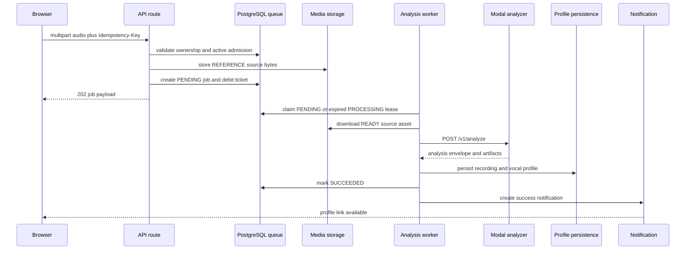
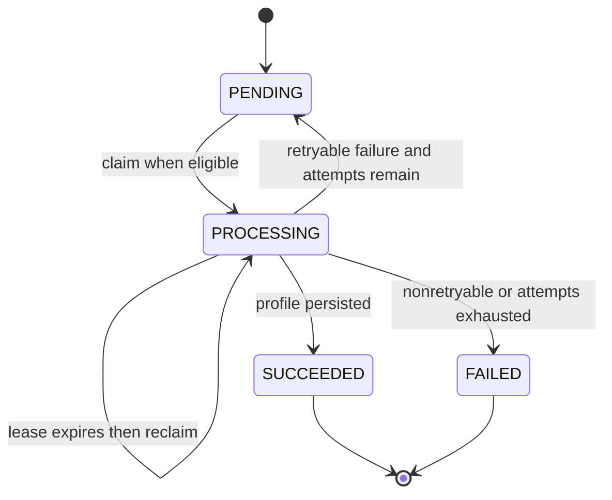

# Vocal Profile Capture and Analysis

## 범위와 진입점

보컬 프로필 생성은 브라우저 녹음과 이미 존재하는 오디오 파일 업로드를 같은 `POST /api/vocal-profile-analysis-jobs` 경로로 보냅니다. 녹음 UI는 `MediaRecorder` 기반 `RecordPlugin`을 사용하고, 5초부터 분석 가능하며 10초를 권장하고 60초에 자동 종료합니다. 완료된 `File`은 클라이언트가 `FormData`의 `audio` 필드와 `Idempotency-Key` 헤더로 제출합니다. [1]

API는 먼저 API session의 사용자 소유권을 확인합니다. multipart 본문은 25 MB 한도로 읽고, `audio`가 `File`이 아니면 `INVALID_UPLOAD`(400)를 반환합니다. enqueue 단계에서는 키가 비어 있거나 200자를 넘으면 `INVALID_IDEMPOTENCY_KEY`(400), 지원되지 않는 MIME type이면 `UNSUPPORTED_AUDIO`(415), 빈 파일 또는 25 MB 초과면 `PAYLOAD_TOO_LARGE`(413)로 분류합니다. 지원 형식 안내는 WAV, MP3, M4A, WebM입니다. [2]

## enqueue: 저장과 티켓의 원자적 admission

`enqueueVocalProfileAnalysis`는 먼저 같은 사용자와 idempotency key의 기존 job을 조회합니다. 있으면 새 업로드를 만들지 않고 기존 job을 반환합니다. 다른 key의 `PENDING` 또는 `PROCESSING` job이 있으면 `ANALYSIS_BUSY`(409)이며, 동시 요청 경합도 PostgreSQL `Serializable` transaction과 사용자별 active-admission unique index가 막습니다. 티켓 잔액이 비용보다 작으면 `InsufficientTicketsError`를 내고, job이나 미디어를 만들기 전에 종료합니다. [2][3]

검증을 통과하면 `storeAnalyzerReferenceBytes`가 원본 바이트를 `REFERENCE` media asset으로 저장합니다. 이후 같은 transaction에서 `VocalProfileAnalysisJob`을 `PENDING`으로 만들고, 비용이 0보다 크면 `VOCAL_ANALYSIS` wallet에 `USAGE_DEBIT` ledger를 기록합니다. transaction write conflict는 최대 세 번 시도하며, 경합으로 생성되지 않은 경우 방금 만든 asset을 폐기합니다. transaction 자체가 실패해도 asset을 폐기합니다. 따라서 queue row와 선불 차감이 함께 admission되고, orphan upload가 남지 않는 것이 invariant입니다. [2]

이 sequence는 원본 저장과 티켓 차감이 enqueue transaction에 속하고, worker가 durable source를 다시 읽어 Modal에 전달한 뒤 결과를 저장한다는 경계를 보여줍니다.

## worker lease와 실행

운영 진입점은 `scripts/vocal-profile-analysis-worker.ts`가 호출하는 `runVocalProfileAnalysisWorker`입니다. runner는 설정된 concurrency만큼 lane을 만들고 lane마다 고유 owner를 부여합니다. 각 lane은 환불 reconciliation을 먼저 수행한 뒤 한 job을 처리하고, 없으면 1초 쉽니다. SIGINT/SIGTERM은 새 loop를 멈춥니다. [4]

claim 쿼리는 `attempts < maxAttempts`, `nextAttemptAt <= now`인 job 중 `PENDING` 또는 lease가 만료된 `PROCESSING`만 후보로 삼고, `FOR UPDATE SKIP LOCKED`로 lane 간 중복 claim을 피합니다. claim은 상태를 `PROCESSING`으로 바꾸고 owner, lease 만료시각, heartbeat, 최초 시작시각을 기록하며 attempts를 1 증가시킵니다. 기본 lease는 300초, 기본 최대 시도는 3회이고 각각 `VOCAL_PROFILE_ANALYSIS_LEASE_SECONDS`(180–3600), `VOCAL_PROFILE_ANALYSIS_MAX_ATTEMPTS`(1–10), concurrency는 `VOCAL_PROFILE_ANALYSIS_WORKER_CONCURRENCY`(1–16)로 조정합니다. 만료된 lease는 다른 worker가 다시 claim할 수 있습니다. [5][6]

이 상태도는 schema와 worker가 실제로 사용하는 `PENDING`, `PROCESSING`, `SUCCEEDED`, `FAILED` 상태 및 그 전이만 나타냅니다.

## source integrity와 Modal 경계

worker는 job의 `sourceAssetId`가 있고, 해당 사용자의 `REFERENCE`·`READY` asset이 존재하는지 확인합니다. 없으면 `ANALYSIS_SOURCE_MISSING`(410)이며 재시도하지 않습니다. asset의 `externalUrl`을 60초 timeout과 `no-store`로 다운로드하고, 429 또는 5xx 다운로드 실패만 retryable인 `ANALYSIS_SOURCE_UNAVAILABLE`로 분류합니다. [5]

`analyzeVocalProfileBytes`는 저장된 바이트를 multipart로 다시 감싸 `X-Recording-ID`와 server API key를 붙여 Modal의 `${VOCAL_PROFILE_MODAL_URL}/v1/analyze`에 보냅니다. adapter는 transport version `modal-analysis-envelope-v1`, `cleanupConfirmed: true`, profile의 recording ID, source 및 synthesis-reference artifact의 base64 디코딩 크기와 SHA-256을 검증합니다. Modal은 ephemeral working directory에서 처리한 뒤 정리 확인을 포함한 envelope를 반환합니다. [7][8]

Modal/adapter 오류는 의미에 따라 나뉩니다. 인증 실패(`ANALYZER_AUTH_FAILED`), analyzer contract 미지원(`ANALYZER_UPDATE_REQUIRED`), source mismatch는 재시도하지 않으며, timeout·unavailable·busy·잘못된 response 등은 코드별 retryable 정책을 따릅니다. worker는 추가로 analyzer가 반환한 source의 바이트 길이, MIME type, SHA-256이 worker가 다운로드한 queued source와 정확히 같은지 확인합니다. 불일치하면 `ANALYZER_SOURCE_MISMATCH`, retryable false로 처리합니다. 이는 분석 결과가 다른 입력에 귀속되는 것을 막는 핵심 invariant입니다. [5][7]

## persistence와 완료

`persistQueuedAnalyzedVocalProfile`은 같은 `recordingId`와 사용자 profile이 이미 있으면 기존 것을 반환하여 worker 재실행을 멱등적으로 만듭니다. 그렇지 않으면 queued `REFERENCE` asset을 재확인하고, source metadata를 비교한 뒤 transaction 안에서 사용자별 profile number를 할당하고 `Recording(kind=USER_TEST, status=READY)`와 `VocalProfile(sourceType=USER)`를 생성합니다. 원본 asset은 복사하지 않고 recording이 durable source asset을 재사용합니다. smart synthesis reference가 있으면 별도 asset 저장을 시도하며 실패해도 source fallback을 표시하고 profile 저장은 계속할 수 있습니다. profile transaction 실패 시 생성한 synthesis asset을 정리하고 `PROFILE_SAVE_FAILED`(retryable)를 냅니다. [9]

저장 후 worker는 job을 `SUCCEEDED`로 바꾸고 profile ID를 연결하며 lease를 해제합니다. transaction 안에서 dedupe key `vocal-analysis:{job.id}:succeeded`인 `VOCAL_PROFILE_SUCCEEDED` notification을 만들고 `/vocal-profiles/{profileId}` 링크를 제공합니다. 클라이언트는 active 상태를 1.5초, active job 목록을 3초 간격으로 polling하고, terminal 상태에서는 polling을 멈춥니다. [5][10]

## 실패, retry, cleanup, refund

worker는 `AnalyzerClientError`와 `VocalProfilePersistenceError`의 `reasonCode`, detail, retryable을 그대로 보존하며, 미분류 예외는 `ANALYSIS_WORKER_FAILED`(retryable)로 분류합니다. retryable이고 `attempts < maxAttempts`이면 job을 lease 해제한 `PENDING`으로 되돌리고 다음 시각을 설정합니다. 지연은 `min(30, 2 ** (attempts - 1))`초입니다. 이 경로에서는 source asset을 삭제하지 않고 notification도 만들지 않습니다. [5]

재시도할 수 없거나 최대 시도에 도달하면 transaction 안에서 `FAILED`로 확정하고 sourceAssetId를 null로 detach하며 error code/detail/retryable, completedAt을 기록합니다. 이어 `VOCAL_PROFILE_FAILED` notification을 `/library?tab=profiles`로 생성하고, queued source media asset을 폐기합니다. 비용이 있으면 `refundState=REQUIRED`로 표시한 뒤 `USAGE_REFUND` ledger를 idempotency key `vocal-analysis-refund:{job.id}`로 적용하고 `REFUNDED`로 전환합니다. refund 호출이 일시 실패해도 job 실패 처리는 끝나며, 다음 worker loop의 reconciliation이 `REQUIRED` job을 다시 환불합니다. 비용이 0이면 ledger 없이 상태만 `REFUNDED`로 정리합니다. [5]

## 운영 점검과 변경 시 주의점

* API에서 400/415/413은 입력을 고치는 비재시도 오류, 409 `ANALYSIS_BUSY`는 활성 job 종료 후 다시 제출할 수 있는 admission 오류, 503 enqueue 실패는 재시도 가능한 경계 오류입니다. job detail의 `error.reasonCode`, `retryable`, attempts/maxAttempts를 우선 확인합니다. [2]
* Modal 장애는 원본 asset이 보존된 채 backoff 재시도되지만, source missing·auth·contract·integrity mismatch 같은 영구 오류는 즉시 실패·정리·환불됩니다. lease 만료가 반복되면 worker concurrency와 lease, analyzer의 120초 요청 timeout을 함께 점검합니다. [5][7]
* Modal URL과 server API key(`VOCAL_PROFILE_MODAL_API_KEY`, fallback `MODAL_API_KEY`)가 없으면 `ANALYZER_NOT_CONFIGURED`(비재시도)입니다. media storage 설정도 persistence 실패를 좌우합니다. [7][9]
* 집중 회귀 테스트는 idempotency와 사용자별 소유권, 빈 wallet의 사전 거부, 동시 admission 한 건 보장 및 loser media 삭제, 만료 lease 재획득, durable source 재사용과 성공 notification, transient failure의 source 보존, terminal failure의 source 삭제·refund·실패 notification을 검증합니다. adapter 테스트는 envelope/artifact integrity와 contract를 검증하고 persistence 통합 테스트는 recording/profile 원자성을 검증합니다. [3][11]

## 근거 파일

[1] `src/_pages/profile/ui/vocal-profile-recorder.tsx`, `src/features/analyze-vocal-profile/api/client.ts`  
[2] `src/_app/api-routes/vocal-profiles/vocal-profiles-route.ts`, `src/features/analyze-vocal-profile/api/analysis-queue.ts`  
[3] `tests/vocal-profile-analysis-queue.integration.ts`  
[4] `scripts/vocal-profile-analysis-worker.ts`, `src/_app/background-jobs/vocal-profile-analysis/runner.ts`  
[5] `src/_app/background-jobs/vocal-profile-analysis/worker.ts`  
[6] `src/shared/config/server-env.ts`, `prisma/schema.prisma`  
[7] `src/entities/vocal-profile/api/analyzer/index.ts`, `src/entities/vocal-profile/api/analyzer/modal-adapter.ts`  
[8] `services/vocal-profile-modal/modal_app.py`, `services/vocal-profile-modal/transport.py`  
[9] `src/entities/vocal-profile/api/persistence.ts`  
[10] `src/features/analyze-vocal-profile/api/client.ts`  
[11] `tests/vocal-profile-analyzer-adapter.test.ts`, `tests/vocal-profile-persistence.integration.ts`
