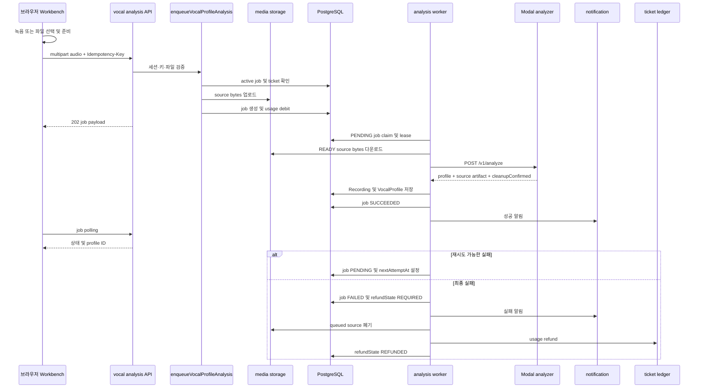

# 보컬 녹음에서 프로필까지

이 문서는 한 소절의 브라우저 녹음 또는 오디오 업로드가 최종 `VocalProfile`이 될 때까지의 현재 런타임을 설명한다. UI는 파일을 준비한 뒤 `POST /api/vocal-profile-analysis-jobs`로 접수하고, 서버는 원본을 `mediaAsset`으로 보존한 뒤 비동기 job을 만든다. 분석 worker만 Modal을 호출하며, 성공 시 프로필을 저장하고 실패 시 재시도·알림·정리·환불을 결정한다.

관련 개념은 [domain data model](/openwiki/concepts/domain-data-model.md), worker 운영 모델은 [durable workers](/openwiki/architecture/durable-workers.md), 외부 저장소와 Modal 경계는 [external services](/openwiki/integrations/external-services.md)에서 확인한다.

## 런타임 순서

이 sequence는 브라우저 접수부터 worker의 최종 분기까지를 보여준다. 성공 알림은 job 상태 변경과 같은 transaction에서 만들어지고, 실패한 원본 삭제와 환불은 그 transaction 뒤에 수행된다.

## 1. 브라우저가 오디오를 준비하고 접수한다

`VocalProfileWorkbench`는 녹음 완료 파일과 선택한 업로드 파일을 같은 `prepareSelectedAudio` 경로로 보낸다. 브라우저는 25 MB 초과 파일을 즉시 거부한다. duration을 읽을 수 있고 60초를 초과하면 사용자의 확인을 받은 뒤 계속한다. 브라우저 metadata를 읽지 못해도 analyzer가 최종 판단하므로, 이 검사는 편의 검사가 아니라 서버 검증을 대체하지 않는다. [Workbench의 녹음·업로드 준비 코드](repo://src/_pages/profile/ui/vocal-profile-workbench.tsx#L168-L239)

분석 버튼은 오디오를 `FormData`의 `audio` 필드로 넣고 새 UUID를 `Idempotency-Key`로 유지한다. 성공적으로 접수하면 job ID를 `localStorage`에 저장하고 job을 polling한다. 상세 polling은 active 상태 또는 retryable 오류일 때 1.5초 간격이고, 목록 polling은 active job이 있을 때 3초 간격이다. [브라우저 API client](repo://src/features/analyze-vocal-profile/api/client.ts#L12-L71)

## 2. API가 접수 경계를 지킨다

`POST /api/vocal-profile-analysis-jobs`는 먼저 API session을 요구한다. 요청 body는 bounded multipart reader로 읽고 `audio`가 `File`인지 확인한다. idempotency key는 헤더에서 읽어 200자 이하인지 검증한다. MIME type은 WAV, MP3, M4A, WebM 계열만 허용하고 파일은 0보다 크며 25 MB 이하여야 한다.

이 검증 결과는 클라이언트가 처리할 수 있는 HTTP 경계로 변환된다.

| 조건 | 응답 | 의미 |
| --- | ---: | --- |
| 잘못된 key 또는 multipart | 400 | 접수하지 않음 |
| 지원하지 않는 audio MIME | 415 | analyzer로 보내지 않음 |
| 25 MB 초과 | 413 | body 제한 또는 파일 검증에서 중단 |
| ticket 부족 | 402 | job과 media asset을 만들지 않음 |
| 다른 active job 존재 | 409 | 사용자당 동시 분석 하나만 허용 |
| 그 밖의 enqueue 오류 | 503 | retryable 접수 실패 |

검증과 사용자별 active job 확인은 API route와 queue 함수 양쪽에 있다. queue는 transaction 안에서도 다시 active job을 세고 `Serializable` isolation을 사용한다. 따라서 경쟁하는 두 요청도 한 요청만 job을 만들 수 있다. 동일 사용자의 동일 key는 기존 job을 반환한다. [분석 job POST route](repo://src/_app/api-routes/vocal-profiles/vocal-profile-analysis-jobs-route.ts#L67-L118) 및 [접수 transaction](repo://src/features/analyze-vocal-profile/api/analysis-queue.ts#L95-L182)

### media asset과 ticket의 순서

서버는 ticket 잔액과 비용을 확인한 뒤 `storeAnalyzerReferenceBytes`로 source bytes를 외부 media storage에 올린다. 그 다음 transaction에서 `VocalProfileAnalysisJob`을 만들고, 비용이 양수이면 `VOCAL_ANALYSIS` usage debit을 같은 transaction에 기록한다. transaction이 기존 idempotent job을 발견하거나 쓰기 경쟁으로 패하면 새로 올린 asset은 `discardMediaAsset`으로 폐기한다. 이후 예외에도 enqueue 함수의 바깥 `catch`가 asset을 폐기한다.

즉, ticket 부족은 media 저장보다 먼저 발생하며, job 생성과 debit은 분리된 성공 상태로 남지 않는다. 이 흐름은 source asset을 job의 `sourceAssetId`에 연결하고, asset의 사용자·`REFERENCE`·`READY` 조건을 worker가 다시 확인할 수 있게 한다. [queue의 media 저장·debit·경쟁 처리](repo://src/features/analyze-vocal-profile/api/analysis-queue.ts#L102-L181)

## 3. worker가 lease를 잡고 source bytes를 검증한다

runner는 설정된 concurrency만큼 lane을 만들고 각 lane에 고유 `leaseOwner`를 부여한다. lane은 환불 보상 작업을 먼저 조정한 뒤 job을 하나 claim하고, 없으면 1초 쉰다. claim query는 `PENDING` 또는 만료된 `PROCESSING`만 대상으로 하며 `attempts < maxAttempts`, `nextAttemptAt <= now`, `FOR UPDATE SKIP LOCKED`를 적용한다. claim과 동시에 status를 `PROCESSING`으로 만들고 attempt를 증가시키며 lease 만료 시각과 heartbeat를 기록한다. 만료된 lease는 다른 worker가 회수할 수 있다. [worker claim 및 runner](repo://src/_app/background-jobs/vocal-profile-analysis/worker.ts#L43-L79), [runner lanes](repo://src/_app/background-jobs/vocal-profile-analysis/runner.ts#L10-L28)

worker는 claimed job의 `leaseOwner`를 다시 확인한다. 이미 같은 `recordingId`와 사용자로 저장된 프로필이 있으면 analyzer를 다시 호출하지 않고 성공 처리한다. 이 중복 성공 경로와 persistence transaction 내부의 재확인으로, timeout 뒤 재실행된 작업이 같은 프로필을 중복 생성하지 않는다.

그렇지 않으면 source asset이 존재하고 해당 사용자 소유이며 `REFERENCE`·`READY`인지 확인한다. 외부 URL에서 `cache: "no-store"`와 60초 timeout으로 bytes를 내려받는다. HTTP 429와 5xx는 retryable source 오류이고, source가 없거나 조건이 맞지 않으면 `ANALYSIS_SOURCE_MISSING` terminal 오류다. [worker의 중복 검사·source 로드](repo://src/_app/background-jobs/vocal-profile-analysis/worker.ts#L235-L284)

## 4. Modal analyzer 호출과 계약

`analyzeVocalProfileBytes`는 다운로드한 bytes를 multipart `audio`로 감싸고 `X-Recording-ID`를 넣는다. Modal adapter는 `VOCAL_PROFILE_MODAL_URL`과 `VOCAL_PROFILE_MODAL_API_KEY`(또는 `MODAL_API_KEY`)가 없으면 `ANALYZER_NOT_CONFIGURED`를 반환한다. 실제 요청은 `${url}/v1/analyze`에 API key를 서버 측 헤더로 보내며 120초 timeout을 사용한다. 401/403은 재시도하지 않고, 429·5xx·timeout·일반 unavailable은 retryable로 매핑한다. [Modal adapter의 인증·HTTP 매핑](repo://src/entities/vocal-profile/api/analyzer/modal-adapter.ts#L34-L45), [upstream 호출](repo://src/entities/vocal-profile/api/analyzer/modal-adapter.ts#L169-L195)

Modal은 FastAPI 전체에 API-key dependency를 적용한다. `/v1/analyze`는 `X-Recording-ID`가 UUID인지 확인하고 chunk 단위로 임시 디렉터리에 업로드한 뒤 `analyze_recording_file`을 호출한다. 응답에는 `transportVersion: "modal-analysis-envelope-v1"`, profile, SHA-256·base64로 인코딩한 source artifact, 선택적 synthesis reference artifact, `cleanupConfirmed: true`가 들어간다. 임시 작업 디렉터리는 응답을 구성한 뒤 정리된다. [Modal analyze endpoint](repo://services/vocal-profile-modal/modal_app.py#L49-L60), [업로드·분석·cleanup 계약](repo://services/vocal-profile-modal/modal_app.py#L199-L304)

Node adapter는 envelope version과 cleanup 확인을 필수로 보고, 각 artifact의 base64 bytes 길이와 SHA-256을 검증한다. source MIME/크기는 profile과도 일치해야 하며, profile이 synthesis reference를 요구하면 그 artifact도 있어야 한다. worker는 반환된 source bytes의 길이, MIME, SHA-256을 원래 queued bytes와 다시 비교한다. 이 검증이 실패하면 `ANALYZER_SOURCE_MISMATCH`로 처리하여 잘못된 분석 결과를 저장하지 않는다. [envelope 검증](repo://src/entities/vocal-profile/api/analyzer/modal-adapter.ts#L48-L142), [worker source integrity check](repo://src/_app/background-jobs/vocal-profile-analysis/worker.ts#L285-L305)

## 5. 분석 결과를 VocalProfile로 저장한다

`persistQueuedAnalyzedVocalProfile`은 source asset을 다시 조회하고 analyzer metadata와 source metadata를 비교한다. 필요한 synthesis reference가 응답에 없으면 invalid response로 실패한다. reference artifact 저장이 실패해도 profile descriptor에 `status: "failed"`와 `fallback: "analysis-source"`를 기록하므로 source asset을 fallback으로 사용할 수 있다.

저장 transaction은 `Recording`을 `USER_TEST`·`READY`로 만들고 queued source asset에 연결한 뒤, identity를 할당하여 분석 수치·descriptors·analyzer 버전과 함께 `VocalProfile`을 만든다. transaction 전후에 동일 recording의 profile을 확인하므로 동시 실행에서 먼저 저장된 결과를 재사용한다. 저장 실패 시 임시 synthesis asset은 폐기되고, retryable `PROFILE_SAVE_FAILED`가 worker로 올라간다. [queued profile persistence](repo://src/entities/vocal-profile/api/persistence.ts#L153-L281)

저장 뒤 worker는 job을 `SUCCEEDED`로 바꾸고 profile ID를 기록하며 lease를 해제한다. 이 변경과 `VOCAL_PROFILE_SUCCEEDED` 알림 생성은 한 transaction이다. 알림의 dedupe key는 `vocal-analysis:${job.id}:succeeded`이고 profile 화면으로 연결된다. [성공 상태와 알림](repo://src/_app/background-jobs/vocal-profile-analysis/worker.ts#L90-L125)

## 6. 실패, retry/lease, cleanup과 환불

실패는 analyzer의 `retryable`과 현재 `attempts < maxAttempts`를 함께 보고 결정한다. 재시도하면 job은 `PENDING`으로 돌아가고 lease를 비우며, 지연은 `min(30, 2 ** (attempts - 1))`초로 최대 30초다. source asset은 이 단계에서 삭제하지 않는다. 최종 실패하면 job은 `FAILED`, `sourceAssetId`는 `null`, 오류 코드·상세·retryable을 저장하고, 유료 job은 `refundState: "REQUIRED"`가 된다.

최종 실패 transaction 안에서만 실패 알림을 만든다. 그 뒤 queued source asset을 `discardMediaAsset`으로 폐기한다. 환불은 `applyTicketChange`에 `USAGE_REFUND`와 job 기반 idempotency key를 전달하고, 성공 후 `refundState`를 `REFUNDED`로 바꾼다. 환불 호출 자체가 실패해도 job은 실패로 남고 오류를 로그에 기록한다. 다음 runner loop의 `reconcileRequiredVocalProfileAnalysisRefunds`가 `REQUIRED` job을 다시 처리하므로 환불과 media cleanup을 한 transaction으로 묶지 않은 경계가 명확하다. 비용이 0이면 ledger를 만들지 않고 곧바로 `REFUNDED`로 표시한다. [실패 release·cleanup·환불](repo://src/_app/background-jobs/vocal-profile-analysis/worker.ts#L167-L233)

클라이언트는 terminal failed job을 localStorage에서 지우고, retryable이면 같은 오디오로 새 submission을 허용한다. succeeded 상태에서는 profile ID가 있어야만 성공으로 간주하고 profile 화면으로 이동한다. [Workbench의 terminal job 처리](repo://src/_pages/profile/ui/vocal-profile-workbench.tsx#L112-L150)

## 설정과 변경 지점

- 접수 한도와 MIME 계약은 `src/features/analyze-vocal-profile/index.model.ts` 및 queue의 `MAX_AUDIO_BYTES`에 있다. Modal core도 자체 25 MB 한도를 적용하므로 한쪽만 늘리지 않는다.
- ticket 비용·최대 시도 횟수·lease 시간·worker concurrency는 `@/shared/config/index.server`의 vocal analysis 설정이 소유한다.
- Modal 배포는 `services/vocal-profile-modal/modal_app.py`의 image, timeout, container autoscaling, `soulx-api-secret`을 사용한다. Node 서버의 Modal URL/API key와 Modal의 `SOULX_API_KEY`는 서로 대응해야 한다.
- analyzer 응답 형식을 바꿀 때는 transport version, artifact integrity, `cleanupConfirmed`, smart-reference contract를 함께 갱신해야 한다. fallback을 제거하거나 source asset 수명을 바꿀 때는 persistence와 terminal cleanup semantics도 함께 검토한다.

## 집중 테스트

- `tests/long-audio-upload.test.ts`: 60초는 허용하고 60초 초과만 긴 오디오 확인을 요구하는 경계를 고정한다.
- `tests/vocal-profile-analysis-queue.integration.ts`: idempotency와 owner-scoped 조회, ticket 부족 시 media 미저장, 동시 admission, 만료 lease 회수, 성공 시 source 재사용, transient 실패 재queue, terminal 실패 시 source 삭제를 검증한다.
- `tests/vocal-profile-analyzer-adapter.test.ts`: Modal API-key 전달, envelope/artifact integrity, 인증 실패의 non-retryable 매핑, 429·5xx retryable 매핑을 검증한다.
- `tests/vocal-profile-persistence.integration.ts`: 분석 profile과 Recording의 transaction 저장, 중복 결과 재사용, synthesis reference 저장/fallback 및 저장 실패 cleanup을 검증한다.

이 테스트들은 단순한 함수 존재보다 이 흐름의 안전한 변경 경계—한 사용자당 active job 하나, 원본 bytes 보존, 중복 성공, retry 중 cleanup 금지, terminal cleanup과 환불의 분리—를 보호한다.
