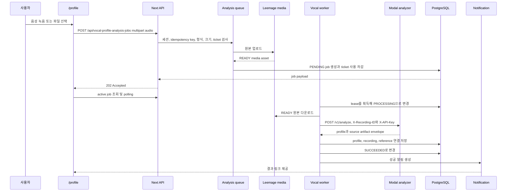

# 보컬 프로필 분석 워크플로

이 워크플로는 사용자가 `/profile`에서 음성을 제출한 뒤 분석 결과를 확인할 때까지의 경로를 설명한다. HTTP 요청은 분석을 직접 수행하지 않는다. 먼저 업로드 원본을 외부 media 저장소와 `VocalProfileAnalysisJob`에 기록하고 `202`를 반환한 다음, 별도 worker가 작업을 가져가 Modal의 동기 HTTP 분석을 호출한다.

관련 개념은 [보컬 분석과 추천](/openwiki/concepts/vocal-analysis-and-recommendations.md), 외부 저장소와 Modal 설정은 [외부 서비스](/openwiki/integrations/external-services.md), worker 운영 관점은 [job processing](/openwiki/operations/job-processing.md)을 참고한다.

## 전체 제어·데이터 흐름



이 그림에서 Modal은 분석 결과를 한 번의 HTTP 응답으로 돌려주는 외부 경계다. 앱의 `VocalProfileAnalysisJob`에는 Modal job ID 필드가 없고, worker도 외부 ID를 저장하거나 외부 작업을 poll하지 않는다. worker가 보유하는 것은 자체 DB job ID와 lease뿐이며, source media를 읽고 Modal 응답을 받은 뒤 같은 실행에서 저장한다.

## 1. 업로드 요청이 durable job이 되는 과정

현재 API 진입점은 다음 두 라우트다.

- `POST /api/vocal-profile-analysis-jobs`는 제출과 job 목록 조회를 제공한다.
- `POST /api/vocal-profiles`도 같은 enqueue 함수를 호출하는 호환 진입점이다.

두 POST 모두 API 세션을 요구하고 `audio`라는 multipart `File`을 읽는다. analysis job 라우트는 `Idempotency-Key`를 검사한다. 허용 오디오 형식은 WAV, MP3, M4A, WebM이고 최대 크기는 25 MB다. 잘못된 업로드는 `400`, 미지원 형식은 `415`, 초과 크기는 `413`으로 반환한다.

`enqueueVocalProfileAnalysis`는 다음 순서를 지킨다.

1. 같은 사용자와 idempotency key의 job을 먼저 찾는다. 이미 있으면 새 media 업로드나 ticket 차감 없이 기존 job을 반환한다.
2. 사용자의 `PENDING` 또는 `PROCESSING` job이 있으면 `ANALYSIS_BUSY`를 반환한다. 이미 저장된 profile 개수는 admission 제한이 아니다.
3. `VOCAL_ANALYSIS` ticket 잔액과 현재 비용을 확인한다. 잔액이 부족하면 job과 media를 만들지 않고 `402 INSUFFICIENT_ANALYSIS_TICKETS`를 반환한다.
4. 업로드 바이트를 Leemage에 올리고 `MediaAsset(kind: REFERENCE, status: READY)`를 만든다. 이 asset의 URL은 나중에 worker가 읽는다.
5. Serializable transaction에서 다시 idempotency와 active job을 확인하고 `PENDING` job을 만든다. job에는 `recordingId`, `sourceAssetId`, `ticketCost`, `maxAttempts`가 들어간다.
6. 비용이 0보다 크면 같은 transaction에서 `USAGE_DEBIT` ledger를 만든다. transaction 충돌은 최대 세 번 재시도한다.

transaction 경쟁으로 다른 요청이 먼저 같은 key를 만들면 현재 요청의 임시 media asset을 버리고 기존 job을 반환한다. 그 밖의 enqueue 실패도 임시 media asset을 정리한 뒤 호출자에게 전달한다. job 모델은 사용자와 idempotency key의 조합을 unique로 보장하고, 사용자별 active job을 막는 DB admission 제약과 조회 index를 갖는다.

성공한 enqueue 응답에는 `id`, 소문자 상태(`pending`), `attempts`, `maxAttempts`, 오류 정보, 생성·수정 시각이 포함된다. 클라이언트는 active job이 있는 동안 목록을 3초마다, 상세 job을 1.5초마다 조회한다. retryable API 오류도 상세 조회 polling을 계속한다.

## 2. worker가 lease를 소유하고 분석하는 과정

운영 프로세스는 다음 명령으로 실행한다.

```bash
pnpm worker:vocal-profile-analysis
```

`scripts/vocal-profile-analysis-worker.ts`는 환경 파일을 읽고 `runVocalProfileAnalysisWorker`를 호출한다. runner는 `VOCAL_PROFILE_ANALYSIS_WORKER_CONCURRENCY`만큼 lane을 만들고, 각 lane에 `process.pid`, lane 번호, UUID를 합친 owner를 부여한다. 기본 concurrency는 1이고 허용 범위는 1–16이다. 각 반복에서 미처리 환불을 최대 10건 조정한 뒤 job 하나를 처리한다. 처리할 job이 없으면 1초 쉰다. `SIGINT`와 `SIGTERM`은 새 반복을 멈추고 현재 lane들이 끝나기를 기다린다.

claim은 PostgreSQL transaction에서 `FOR UPDATE SKIP LOCKED`로 가장 오래된 후보 하나를 고른다. 후보 조건은 다음과 같다.

- `attempts < maxAttempts`
- `nextAttemptAt <= now`
- `PENDING`이거나, `PROCESSING`이면서 `leaseExpiresAt`이 없거나 만료됨

claim 순간 상태를 `PROCESSING`으로 바꾸고 owner, lease 만료 시각, heartbeat 시각, 최초 시작 시각을 기록하며 `attempts`를 1 증가시킨다. lease 기본값은 300초이고 `VOCAL_PROFILE_ANALYSIS_LEASE_SECONDS`로 180–3,600초 범위에서 설정한다. heartbeat는 claim과 완료 시 기록된다. 별도 heartbeat loop는 없다. 따라서 실행이 lease보다 오래 걸리거나 프로세스가 죽으면 lease 만료 뒤 다른 worker가 같은 job을 다시 claim할 수 있다. integration test는 만료 전에는 두 번째 worker가 claim하지 못하고, 만료 후에는 두 번째 시도가 가능함을 검증한다.

처리 worker는 먼저 같은 사용자와 `recordingId`의 profile이 이미 있는지 확인한다. 있으면 분석을 반복하지 않고 job을 성공 처리한다. 그렇지 않으면 다음을 수행한다.

1. job의 `sourceAssetId`가 존재하고, 사용자 소유이며, `REFERENCE`이고 `READY`인지 확인한다. 없으면 retry 불가능한 `ANALYSIS_SOURCE_MISSING`이다.
2. media asset의 `externalUrl`을 60초 timeout과 `no-store`로 다운로드한다. 429와 5xx는 재시도 가능하고, 그 밖의 다운로드 오류는 실패로 분류한다.
3. 받은 바이트를 `analyzeVocalProfileBytes`에 전달한다. 이 함수는 multipart body를 만들어 Modal adapter에 넘긴다.
4. 응답의 source 바이트 길이, MIME type, SHA-256을 큐에 넣은 원본과 비교한다. 다르면 `ANALYZER_SOURCE_MISMATCH`로 즉시 종료한다.
5. 검증된 결과를 durable source asset을 재사용하는 `persistQueuedAnalyzedVocalProfile`에 전달한다.

## 3. Modal 동기 분석과 응답 경계

Modal adapter는 `VOCAL_PROFILE_MODAL_URL`과 `VOCAL_PROFILE_MODAL_API_KEY`를 요구하며, API key가 없으면 `ANALYZER_NOT_CONFIGURED`를 반환한다. worker는 `${url}/v1/analyze`로 `POST`하고 원본 multipart의 `Content-Type`, `X-Recording-ID`, `X-API-Key`를 보낸다. 요청 timeout은 120초다.

Modal의 `/v1/analyze`는 업로드를 임시 작업 디렉터리에 chunk 단위로 받고 25 MB를 다시 제한한다. `librosa-pyin` 분석 후 profile과 source, 선택적 smart synthesis reference artifact를 base64 envelope으로 직렬화하고 임시 디렉터리 cleanup을 확인한 뒤 응답한다. API key는 `X-API-Key`로 검증한다.

앱 adapter는 다음 계약을 검증한다.

- `transportVersion`은 `modal-analysis-envelope-v1`이고 `cleanupConfirmed`는 `true`여야 한다.
- profile의 `recordingId`가 요청 ID와 같아야 한다.
- artifact의 파일명, MIME type, 크기, SHA-256, base64 바이트가 유효해야 한다.
- source metadata가 profile과 일치해야 하며, profile이 synthesis reference를 선언하면 해당 artifact도 있어야 한다.
- profile은 smart reference contract를 만족해야 한다.

이 경계에는 비동기 외부 job lifecycle이 없다. Modal endpoint는 요청 안에서 분석하고 JSON을 반환하며, 앱 코드는 응답을 해석한 뒤 계속한다. `VocalProfileAnalysisJob`의 상태와 재시도는 앱 DB가 소유한다. 반면 비교 대상인 다른 mixing job의 `modalJobId`를 이 흐름에 재사용하거나 추가해서는 안 된다.

## 4. profile과 reference 저장

`persistQueuedAnalyzedVocalProfile`은 queued `REFERENCE` asset의 사용자, 상태, MIME type, 바이트 크기를 다시 확인한다. source가 queued source와 다르면 retry 불가능한 `ANALYZER_SOURCE_MISMATCH`다. 분석 결과에 smart synthesis reference가 있으면 별도의 `SYNTHESIS_REFERENCE` media asset을 저장한다. 이 부가 asset 저장이 실패해도 source fallback을 남기고 profile 저장은 계속한다.

이후 transaction에서 사용자별 profile 번호를 원자적으로 할당하고 다음을 기록한다.

- `Recording(kind: USER_TEST, status: READY)`
- recording과 queued `REFERENCE` media asset의 연결
- profile의 pitch 범위, tessitura, voiced ratio, 안정성, clipping, RMS, analyzer와 version, descriptors
- 저장에 성공한 `SYNTHESIS_REFERENCE` asset이 있으면 profile 연결

동시 저장 경쟁으로 이미 같은 recording의 profile이 생기면 기존 profile을 반환한다. 정상 저장 후 worker는 job에 `vocalProfileId`를 연결하고 `SUCCEEDED`로 바꾸며 lease를 해제하고 완료 시각을 기록한다. 같은 transaction에서 dedupe key `vocal-analysis:{job.id}:succeeded`인 성공 알림을 만들고 `/vocal-profiles/{profileId}` 링크를 제공한다.

## 5. 재시도, terminal failure, 환불과 알림

실패 분류는 `AnalyzerClientError`, `VocalProfilePersistenceError`, source mismatch, 그 밖의 예외에서 나온다. retryable 실패이고 `attempts < maxAttempts`이면 job은 `PENDING`으로 돌아가고 source asset은 유지된다. 다음 시각은 지수 backoff를 사용한다.

- 시도 간 지연: `min(30, 2 ** (attempts - 1))`초
- `errorCode`, 최대 2,000자의 `errorDetail`, `retryable: true` 저장
- lease owner와 만료 시각 해제

Modal 5xx, 429, timeout, 일시적 profile 저장 오류가 이 경로에 해당한다. 이때 terminal notification은 만들지 않는다. integration test는 `ANALYZER_UNAVAILABLE`이 `PENDING`으로 재큐잉되고 source가 삭제되지 않음을 확인한다.

retryable이 아니거나 최대 시도 횟수에 도달하면 terminal failure다.

1. job을 `FAILED`로 바꾸고 오류 코드·상세·retryable·완료 시각을 기록한다.
2. `sourceAssetId`를 null로 detach한다.
3. 같은 transaction에서 `VOCAL_PROFILE_FAILED` 알림을 만든다. 메시지는 새 음성으로 다시 분석하라는 내용이고 링크는 `/library?tab=profiles`다.
4. 기존 source media asset을 `discardMediaAsset`으로 삭제한다. 외부 삭제가 실패하면 asset은 `DELETE_PENDING`이 되고 media cleanup job으로 후속 처리된다.
5. ticket cost가 있으면 `refundState`를 `REQUIRED`로 두고 `USAGE_REFUND`를 idempotency key `vocal-analysis-refund:{job.id}`로 적용한 뒤 `REFUNDED`로 바꾼다. 비용이 0이면 ledger 없이 바로 `REFUNDED`로 표시한다.

환불 자체가 실패해도 terminal job과 실패 알림은 이미 기록된다. worker runner는 매 lane 반복의 시작에서 `refundState: REQUIRED` job을 최대 10건 보상 처리하므로, 다음 worker 실행에서도 환불을 재개할 수 있다. 환불과 실패 정리는 별개이므로 운영자는 `FAILED`, `refundState`, media cleanup 상태를 함께 확인해야 한다.

## 확인해야 할 테스트

변경 후 최소한 다음 테스트를 기준으로 동작을 확인한다.

```bash
pnpm exec tsx --test tests/vocal-profile-analysis-queue.integration.ts
pnpm exec vitest run tests/vocal-profile-analyzer-adapter.test.ts
pnpm exec tsx --test tests/vocal-profile-persistence.integration.ts
```

- `tests/vocal-profile-analysis-queue.integration.ts`: idempotency, 사용자별 active job 단일성, ticket 선검사, lease 만료 복구, source asset 재사용, transient retry, terminal cleanup·환불·알림을 검증한다. DB가 없으면 integration test가 skip될 수 있다.
- `tests/vocal-profile-analyzer-adapter.test.ts`: Modal URL/API key 설정, 요청 헤더와 endpoint, timeout·HTTP 오류 매핑, envelope과 artifact 무결성, cleanup contract를 검증한다.
- `tests/vocal-profile-persistence.integration.ts`: profile·recording·reference 저장과 smart synthesis reference의 성공·fallback·실패 정리를 검증한다.

profile 화면을 바꾸는 경우에는 API의 job payload와 클라이언트 polling 계약도 함께 확인한다. worker를 확장할 때는 외부 Modal job ID를 도입하기보다, 현재처럼 앱 job의 lease와 상태 전이를 먼저 명확히 유지해야 한다.
