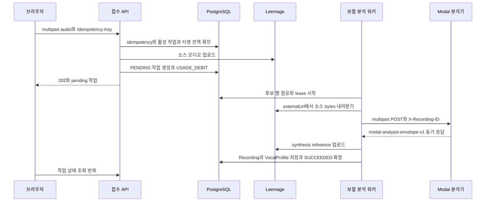

# 보컬 프로필 분석 흐름

오디오 한 건은 두 단계로 나뉘어 VocalProfile이 돼요. 먼저 접수 API가 소스를 Leemage에 올리고 PostgreSQL에 `PENDING` 작업 행과 티켓 차감을 함께 남겨요. 그다음 워커가 그 행을 점유해 Modal에 한 번 동기 호출을 보내고, 응답으로 받은 수치와 파일을 그대로 프로필 행으로 저장해요. 그래서 브라우저가 보는 것은 "오디오 전송"과 "분석 상태 조회" 두 가지뿐이고, 실제 분석은 요청과 분리된 워커 프로세스에서 진행돼요.

이 페이지는 그 단계 순서와 각 단계가 남기는 상태를 설명해요. 점유·lease·재시도 알고리즘 자체는 [Job 큐와 lease 복구 계약](../operations/job-processing.md)이 소유하고, Modal 서비스의 입력·인증 계약은 [Modal 서비스와 외부 계약](../integrations/modal-services.md)이 정리해요. 여기서는 이 흐름에 필요한 조건만 짚고 링크해요.

접수 API가 큐를 만들고 워커가 Modal 호출과 저장을 끝내는 순서예요. Modal 구간에는 외부 작업 ID도 poll 반복도 없어요.

## 업로드 한도와 비용

값을 바꾸려면 이 표의 출처를 고치세요. 서버가 파일을 받기 전에 브라우저도 같은 상한을 검사해요([vocal-profile-workbench.tsx](repo://src/_pages/profile/ui/vocal-profile-workbench.tsx#L206-L226)).

| 항목 | 값 | 출처 |
| --- | --- | --- |
| 최대 오디오 크기 | 25MiB(`MAX_AUDIO_BYTES` = `25 * 1024 * 1024`) | [analysis-queue.ts](repo://src/features/analyze-vocal-profile/api/analysis-queue.ts#L38-L38), [contract.ts](repo://src/features/analyze-vocal-profile/model/contract.ts#L4-L4) |
| multipart 요청 본문 상한 | 파일 상한 + 1MiB 오버헤드 | [multipart.server.ts](repo://src/shared/api/multipart.server.ts#L11-L15) |
| 지원 MIME | `audio/wav`, `audio/x-wav`, `audio/mpeg`, `audio/mp4`, `audio/aac`, `audio/x-m4a`, `audio/webm` | [upload-formats.ts](repo://src/shared/lib/audio/upload-formats.ts#L3-L11) |
| 티켓 비용 | `VOCAL_PROFILE_ANALYSIS_TICKET_COST` 기본 1 | [server-env.ts](repo://src/shared/config/server-env.ts#L26-L28) |
| 워커 최대 시도 횟수 | `VOCAL_PROFILE_ANALYSIS_MAX_ATTEMPTS` 기본 3 | [server-env.ts](repo://src/shared/config/server-env.ts#L50-L52) |
| lease 길이 | `VOCAL_PROFILE_ANALYSIS_LEASE_SECONDS` 기본 300초 | [server-env.ts](repo://src/shared/config/server-env.ts#L54-L56) |
| 워커 동시성 | `VOCAL_PROFILE_ANALYSIS_WORKER_CONCURRENCY` 기본 1 | [server-env.ts](repo://src/shared/config/server-env.ts#L46-L48) |

브라우저는 제출 전에 선택한 오디오를 60초로 자르고 16kHz 모노로 다시 인코딩해요. 그래서 서버가 받는 파일은 사용자가 고른 원본과 크기·포맷이 다를 수 있어요([profile-upload.ts](repo://src/shared/lib/audio/profile-upload.ts#L1-L6), [profile-upload.ts](repo://src/shared/lib/audio/profile-upload.ts#L51-L129)).

## 접수: 작업 행과 차감을 한 트랜잭션에서 확정해요

브라우저는 `POST /api/vocal-profile-analysis-jobs`에 `audio` 파일과 `Idempotency-Key` 헤더를 보내고, 성공하면 `202`와 소문자 상태로 직렬화한 작업을 받아요([client.ts](repo://src/features/analyze-vocal-profile/api/client.ts#L60-L72)). 요청 처리 순서는 이래요([vocal-profile-analysis-jobs-route.ts](repo://src/_app/api-routes/vocal-profiles/vocal-profile-analysis-jobs-route.ts#L81-L129)).

1. `requireApiSession`으로 세션을 확인하고, 없으면 401로 끝내요.
2. `Idempotency-Key`가 비었거나 200자를 넘으면 `INVALID_IDEMPOTENCY_KEY` 400이에요.
3. 같은 `(userId, idempotencyKey)` 작업이 이미 있으면 새로 만들지 않고 그 작업을 `202`로 돌려줘요. 다른 요청 키로 진행 중인 작업이 있으면 `ANALYSIS_BUSY` 429에 `Retry-After: 10`이 붙어요.
4. 분석 티켓 잔액이 비용보다 적으면 `INSUFFICIENT_ANALYSIS_TICKETS` 402로 거절해요.
5. 오디오를 검사한 뒤 `storeAnalyzerReferenceBytes`로 Leemage에 올려 `REFERENCE` 미디어 자산 행을 만들어요.
6. `Serializable` 트랜잭션에서 큐 종류 `VOCAL`의 접수 lock을 잡고, 같은 키의 작업을 다시 확인한 다음 활성 작업이 0건인지 세고, 큐 용량을 확인하고, 작업을 `PENDING`으로 만들고 `vocal-analysis:debit:{userId}:{요청키}` 키로 `USAGE_DEBIT`을 적용해요.

5번과 6번 사이가 이 경로의 약한 지점이라, 트랜잭션이 실패하거나 경쟁에서 밀리면 이미 올린 자산을 `discardMediaAsset`으로 폐기해요. 그래서 실패한 접수는 작업 행도 티켓 차감도 참조되지 않는 자산도 남기지 않아요([analysis-queue.ts](repo://src/features/analyze-vocal-profile/api/analysis-queue.ts#L108-L195), [analysis-queue.ts](repo://src/features/analyze-vocal-profile/api/analysis-queue.ts#L175-L194)).

활성 작업 1건 제한은 두 곳에서 강제돼요. 접수 함수가 `PENDING`·`PROCESSING` 행 수를 세고, DB에는 `status`가 그 두 값일 때만 걸리는 부분 unique 인덱스 `VocalProfileAnalysisJob_one_active_per_user`가 있어요. 그래서 동시에 들어온 서로 다른 요청 키 두 건은 정확히 한 건만 통과해요([analysis-queue.ts](repo://src/features/analyze-vocal-profile/api/analysis-queue.ts#L64-L72), [migration.sql](repo://prisma/migrations/20260814185000_vocal_analysis_active_admission/migration.sql#L1-L4), [tests/vocal-profile-analysis-queue.integration.ts](repo://tests/vocal-profile-analysis-queue.integration.ts#L340-L411)).

접수 진입점은 두 곳이에요. 앞에서 본 `/api/vocal-profile-analysis-jobs`가 응답 스키마 검증까지 하는 경로이고, `/api/vocal-profiles`의 POST도 같은 `enqueueVocalProfileAnalysis`를 호출해요([vocal-profiles-route.ts](repo://src/_app/api-routes/vocal-profiles/vocal-profiles-route.ts#L63-L96)). 어느 쪽으로 들어와도 작업 행과 차감을 만드는 규칙은 같아요.

## 워커: 점유 → Modal 동기 호출 → 저장

워커 러너는 별도 프로세스로 돌고, 매 반복마다 남은 환불을 먼저 재처리한 뒤 작업 하나를 점유해요([runner.ts](repo://src/_app/background-jobs/vocal-profile-analysis/runner.ts#L20-L41), [package.json](repo://package.json#L20-L20)). 점유된 작업 하나는 이 순서로 처리돼요([worker.ts](repo://src/_app/background-jobs/vocal-profile-analysis/worker.ts#L239-L342)).

1. `startJobLease`가 소유권을 다시 확인하고 heartbeat 갱신, deadline 타이머, 외부 호출에 전파할 `AbortSignal`을 함께 만들어요. 이 작업의 `deadlineAt`은 처음 점유될 때 `now + 15분`으로 채워지고 재시도해도 늘어나지 않아요([worker.ts](repo://src/_app/background-jobs/vocal-profile-analysis/worker.ts#L47-L83), [lease.ts](repo://src/shared/lib/runtime/lease.ts#L38-L97)).
2. 같은 `recordingId`의 프로필이 이미 저장돼 있으면 분석을 다시 하지 않고 `SUCCEEDED`로 맞춰요. 이전 워커가 저장까지 마치고 죽은 경우를 되돌리는 경로예요([worker.ts](repo://src/_app/background-jobs/vocal-profile-analysis/worker.ts#L255-L262)).
3. `sourceAssetId`가 가리키는 `REFERENCE` 자산이 `READY`인지 확인하고, 그 `externalUrl`에서 소스 bytes를 60초 타임아웃으로 내려받아요. 자산이 사라졌으면 `ANALYSIS_SOURCE_MISSING`(재시도 불가)이에요([worker.ts](repo://src/_app/background-jobs/vocal-profile-analysis/worker.ts#L267-L298)).
4. `analyzeVocalProfileBytes`가 multipart 요청을 만들어 Modal `POST /v1/analyze`를 한 번 호출하고 응답을 기다려요. 요청 타임아웃은 120초이고, `X-Recording-ID`와 `X-API-Key` 헤더를 붙여요([analyzer/index.ts](repo://src/entities/vocal-profile/api/analyzer/index.ts#L27-L50), [modal-adapter.ts](repo://src/entities/vocal-profile/api/analyzer/modal-adapter.ts#L169-L196)).
5. 응답 envelope를 검증하고, 내려받은 소스 bytes와 응답의 `artifacts.source`가 크기와 SHA-256에서 같은지 워커가 다시 확인해요. 다르면 `ANALYZER_SOURCE_MISMATCH`로 실패시켜요([worker.ts](repo://src/_app/background-jobs/vocal-profile-analysis/worker.ts#L306-L312)).
6. `persistQueuedAnalyzedVocalProfile`이 Recording과 VocalProfile을 만들고, 같은 트랜잭션에서 `SUCCEEDED` 확정과 `VOCAL_PROFILE_SUCCEEDED` 알림을 함께 써요([persistence.ts](repo://src/entities/vocal-profile/api/persistence.ts#L153-L292), [worker.ts](repo://src/_app/background-jobs/vocal-profile-analysis/worker.ts#L94-L137)).

Modal 구간에는 외부 작업 ID 저장도 상태 poll도 없어요. `VocalProfileAnalysisJob`에는 `externalJobId` 컬럼이 없어서([schema.prisma](repo://prisma/schema.prisma#L540-L574)) 워커는 응답 본문을 그 자리에서 쓰고, 이 호출이 접수됐는지 확인하는 일은 응답 envelope 검증이 맡아요. 곡 분석·믹싱과의 계약 차이는 [Modal 서비스와 외부 계약](../integrations/modal-services.md)에 정리돼 있어요.

### 응답 envelope 검증 조건

adapter는 `transportVersion`이 `modal-analysis-envelope-v1`이고 `cleanupConfirmed`가 정확히 `true`인지 먼저 봐요. 그다음 artifact마다 `contentBase64`를 디코딩한 bytes의 길이와 SHA-256이 `sizeBytes`·`sha256`과 같은지, `source`의 MIME과 크기가 `profile`의 값과 같은지, `profile.synthesisReference`가 있으면 그 descriptor와 artifact가 서로 맞는지를 차례로 확인해요. 이 조건이 어긋나면 `ANALYZER_INVALID_RESPONSE` 502로 끝나고 저장은 시작되지 않아요([modal-adapter.ts](repo://src/entities/vocal-profile/api/analyzer/modal-adapter.ts#L34-L143)). `profile.recordingId`가 요청한 id와 다르면 `ANALYSIS_FAILED` 502로 거절해요. 이 id는 adapter와 `analyzeVocalProfile`이 각각 확인해서, 다른 녹음의 결과가 이 작업의 프로필로 저장되는 일을 막아요([modal-adapter.ts](repo://src/entities/vocal-profile/api/analyzer/modal-adapter.ts#L104-L107), [analyzer/index.ts](repo://src/entities/vocal-profile/api/analyzer/index.ts#L11-L25)).

| 응답 상황 | 코드와 재시도 여부 |
| --- | --- |
| 분석기가 거절(예: `TOO_SILENT` 422) | 응답의 `reasonCode`를 그대로 쓰고 재시도하지 않아요 |
| 인증 실패 401·403 | `ANALYZER_AUTH_FAILED`, 재시도 불가 |
| 분석기 혼잡 429 | `ANALYZER_BUSY`, 재시도 가능 |
| 5xx 또는 네트워크 오류 | `ANALYZER_UNAVAILABLE`, 재시도 가능 |
| 120초 초과 | `ANALYZER_TIMEOUT`, 재시도 가능 |
| envelope 불일치 | `ANALYZER_INVALID_RESPONSE`, 재시도 가능 |
| 스마트 레퍼런스 계약 미지원 | `ANALYZER_UPDATE_REQUIRED`, 재시도 불가. 오래된 분석기를 배포한 상태라 응답 자체는 유효하지만 저장하지 않아요([analyzer/index.ts](repo://src/entities/vocal-profile/api/analyzer/index.ts#L11-L25)) |

이 분류가 워커의 재시도 판단 입력이 돼요([modal-adapter.ts](repo://src/entities/vocal-profile/api/analyzer/modal-adapter.ts#L145-L167), [tests/vocal-profile-analyzer-adapter.test.ts](repo://tests/vocal-profile-analyzer-adapter.test.ts#L154-L231)).

## 저장: 큐에 올린 소스를 재사용하고 합성 레퍼런스를 따로 올려요

저장 단계는 오디오를 다시 올리지 않아요. 접수 때 만든 `REFERENCE` 자산을 그대로 `Recording.mediaAsset`에 연결하고, `Recording.id`는 작업의 `recordingId`와 같은 값으로 만들어요. 그래서 `Recording`과 `VocalProfileAnalysisJob` 사이에 FK가 없어도 두 행이 같은 id 규약으로 연결돼요([persistence.ts](repo://src/entities/vocal-profile/api/persistence.ts#L232-L271), [data-model.md](../architecture/data-model.md)).

프로필 번호는 `User.nextVocalProfileNumber`를 트랜잭션 안에서 1 증가시켜 배정하고, 표시 이름은 `보컬 프로필 {번호}`로 만들어요. 수치 컬럼과 `descriptors` JSON, `analyzer`·`analyzerVersion`은 응답 값을 그대로 옮겨요.

스마트 합성 레퍼런스는 별도 `SYNTHESIS_REFERENCE` 자산으로 Leemage에 올리고, 성공하면 `synthesisReferenceAssetId`를 연결하면서 `descriptors.synthesisReferenceStorage`에 `{ status: "ready", kind: "SYNTHESIS_REFERENCE" }`를 남겨요.

이 업로드가 실패해도 프로필 저장은 실패시키지 않아요. 대신 `descriptors.synthesisReferenceStorage`를 `{ status: "failed", fallback: "analysis-source" }`로 표시하고 `synthesisReferenceAssetId` 없이 프로필을 저장해요([persistence.ts](repo://src/entities/vocal-profile/api/persistence.ts#L190-L217), [tests/vocal-profile-persistence.integration.ts](repo://tests/vocal-profile-persistence.integration.ts#L156-L175)). 이 fallback은 이후 믹싱 레퍼런스 선택으로 이어져요. 스마트 자산이 없으면 믹싱은 사용자가 올린 원본 `REFERENCE`를 쓰고, `smart-reference-mid-v1` 계약 프로필이면 원본으로 내려가지 않고 `MIXING_REFERENCE_UNAVAILABLE`로 거절해요([reference.ts](repo://src/features/create-mixing/model/reference.ts#L12-L29), [contract.ts](repo://src/entities/vocal-profile/model/contract.ts#L201-L212)). 그 선택 규칙과 전체 믹싱 절차는 [AI 믹싱 작업 흐름](ai-mixing.md)이 소유해요.

프로필 행 생성 트랜잭션 자체가 실패하면 합성 레퍼런스 자산을 폐기하고 `PROFILE_SAVE_FAILED` 500(재시도 가능)로 끝내요. 이미 다른 경로가 같은 `recordingId`의 프로필을 만들었으면 그 행을 그대로 돌려줘요([persistence.ts](repo://src/entities/vocal-profile/api/persistence.ts#L219-L291)).

같은 파일에는 소스 오디오를 다시 올리면서 Recording까지 한 트랜잭션에서 만드는 `persistAnalyzedVocalProfile`도 있어요. 이 함수는 소스 업로드 실패를 `STORAGE_UPLOAD_FAILED`(재시도 가능) 또는 `STORAGE_NOT_CONFIGURED`(재시도 불가)로 구분해 돌려주지만, 현재 코드에서 이 함수를 부르는 워커 경로는 없고 [tests/vocal-profile-persistence.integration.ts](repo://tests/vocal-profile-persistence.integration.ts#L70-L218)가 저장 실패 세 모드의 보상 동작을 이 함수로 확인해요([persistence.ts](repo://src/entities/vocal-profile/api/persistence.ts#L34-L58)).

## 실패·재시도·환불은 어디서 갈라지나

재시도 대상이면 워커가 오류 코드와 `retryable`을 남기고 행을 `PENDING`으로 되돌리며 소스 자산은 지우지 않아요. 그래서 다음 반복이 같은 `sourceAssetId`로 다시 시도할 수 있어요([worker.ts](repo://src/_app/background-jobs/vocal-profile-analysis/worker.ts#L170-L198), [tests/vocal-profile-analysis-queue.integration.ts](repo://tests/vocal-profile-analysis-queue.integration.ts#L484-L519)).

오류가 났는데 같은 `recordingId`의 프로필이 이미 있으면 실패로 확정하지 않고 `SUCCEEDED`로 맞춰요. 저장과 확정 사이에서 프로세스가 죽어 "결과는 있는데 상태는 진행 중"인 행이 남는 상황을 닫는 경로예요. 다만 `JobDeadlineError`는 저장 여부와 무관하게 실패로 확정돼요([worker.ts](repo://src/_app/background-jobs/vocal-profile-analysis/worker.ts#L324-L341)).

재시도로 풀리지 않으면 terminal 경로가 한 트랜잭션에서 `FAILED` 확정, `sourceAssetId` 비우기와 소스 자산 삭제 예약, `VOCAL_PROFILE_FAILED` 알림 생성, `refundState`를 `REQUIRED`로 표시하기를 함께 처리해요. 티켓 비용이 0이면 `refundState`는 `NONE`으로 남아요([worker.ts](repo://src/_app/background-jobs/vocal-profile-analysis/worker.ts#L200-L236)). 알림 문구·`href`·`dedupeKey` 규칙은 [알림과 중복 방지](../concepts/notifications.md)가, 삭제를 예약한 자산이 실제로 정리되는 절차는 [미디어 저장과 정리 의도](../operations/media-storage.md)가 소유해요.

환불 자체는 확정 트랜잭션 밖에서 실행돼요. `refundRequiredVocalProfileAnalysisTicket`은 작업 행을 잠그고 `refundState`가 `REQUIRED`인지 다시 확인한 뒤, `vocal-analysis-refund:{jobId}` 키로 `USAGE_REFUND`를 적용하고 상태를 `REFUNDED`로 바꿔요. 이 함수는 러너가 매 반복 `reconcileRequiredVocalProfileAnalysisRefunds(10)`으로 다시 불러서, 확정과 환불 사이에 프로세스가 죽어도 남은 `REQUIRED` 행이 다음 반복에 처리돼요([worker.ts](repo://src/_app/background-jobs/vocal-profile-analysis/worker.ts#L139-L168), [runner.ts](repo://src/_app/background-jobs/vocal-profile-analysis/runner.ts#L25-L26)). 원장 키 규칙은 [티켓 원장과 멱등성](../concepts/ticket-ledger.md)이, 상태 전이와 재시도 backoff 표는 [Job 큐와 lease 복구 계약](../operations/job-processing.md)이 다뤄요.

## 저장된 프로필이 화면에 도착하기까지

작업 상태는 `pending`, `processing`, `succeeded`, `failed` 네 값으로 직렬화되고, 응답에는 `attempts`, `maxAttempts`, 실패 시 `error` 객체가 함께 담겨요([contract.ts](repo://src/entities/vocal-profile/model/contract.ts#L141-L165), [analysis-queue.ts](repo://src/features/analyze-vocal-profile/api/analysis-queue.ts#L40-L53)).

브라우저는 작업이 `pending`이거나 `processing`인 동안에만 상태 조회를 반복하고, 종료 상태가 되면 반복을 멈춰요. 상세 조회와 목록 조회의 주기, 조회가 실패했을 때 다시 시도할지 판단하는 규칙은 [브라우저 상태와 API 오류 계약](../architecture/client-data-flow.md)이 소유하니 그쪽 표를 보세요.

화면 전환은 작업이 `succeeded`이고 결과 프로필 id가 준비된 때에만 일어나요. 그때 브라우저가 프로필 상세(`/vocal-profiles/{profileId}`)로 이동해요. 실패했거나 프로필 id가 아직 없으면 이동하지 않고 작업 화면에 남아요. 진행 중 작업 id는 `localStorage`에 남겨서 새로고침 뒤에도 같은 작업을 이어서 볼 수 있어요([vocal-profile-workbench.tsx](repo://src/_pages/profile/ui/vocal-profile-workbench.tsx#L112-L142)).

목록 화면은 진행 중 작업을 먼저 보여주고, 재시도 중인 작업은 `attempts`와 `maxAttempts`를 함께 표시해요([vocal-profile-library.tsx](repo://src/widgets/library/ui/vocal-profile-library.tsx#L26-L53)). 완료된 프로필 목록과 상세는 `sourceType: "USER"` 행만 조회하고, 표시 이름이 비어 있으면 `보컬 프로필 {번호}`로 대체해요([history.ts](repo://src/entities/vocal-profile/api/history.ts#L56-L101)).

## 다음에 볼 문서

- 점유·lease·deadline·재시도 backoff 규칙 전체는 [Job 큐와 lease 복구 계약](../operations/job-processing.md)에 있어요.
- Modal endpoint와 envelope 직렬화는 [Modal 서비스와 외부 계약](../integrations/modal-services.md)이 정리해요.
- 소스 자산 업로드·삭제 의도와 `MediaOperation` 상태는 [미디어 저장과 정리 의도](../operations/media-storage.md)가 설명해요.
- 알림 문구·`href`·`dedupeKey`와 읽음 상태는 [알림과 중복 방지](../concepts/notifications.md)에 있어요.
- 브라우저 상태 조회 주기와 오류 재시도 판단은 [브라우저 상태와 API 오류 계약](../architecture/client-data-flow.md)에 있어요.
- `descriptors` 구조와 컬럼 의미는 [데이터 모델과 수명 주기 상태](../architecture/data-model.md)에 있어요.
- 이 흐름을 검증하는 명령은 `pnpm run test:vocal-profile-analysis-queue`, `pnpm run test:vocal-profile-persistence`, `pnpm run test:vocal-profile-analyzer`예요([package.json](repo://package.json#L48-L50)).
- 실패 원인별로 어떤 테스트 파일이 어떤 동작을 증명하는지는 [변경 검증 경로](../testing/verification.md)에 있어요.
