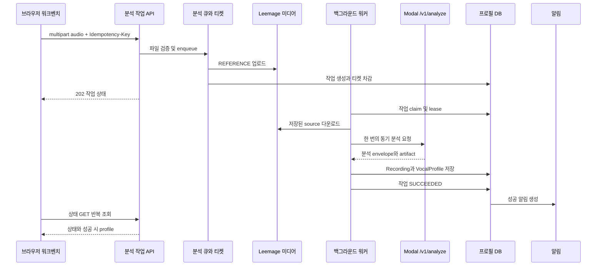
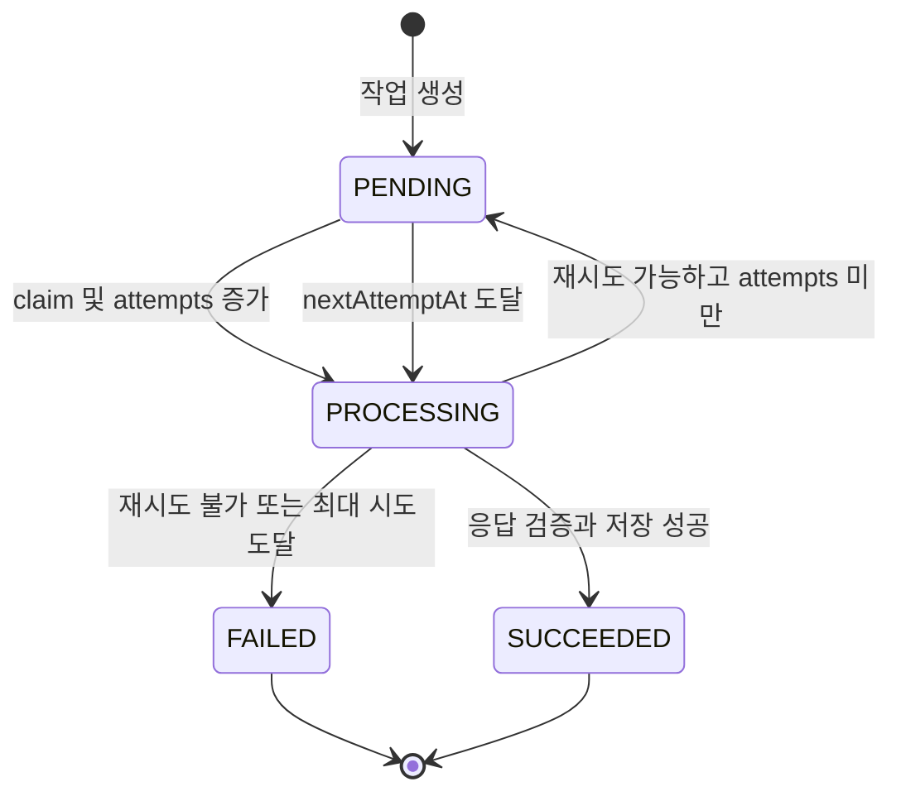

# 보컬 프로필 캡처 및 분석 워크플로

보컬 프로필 분석은 브라우저가 분석 서버를 직접 기다리는 방식이 아니라, 먼저 `VocalProfileAnalysisJob`을 만들고 백그라운드 워커가 처리하는 구조다. 입력은 브라우저 녹음(`recording`)이나 파일 업로드(`upload`)에서 오지만, 큐에 들어간 뒤의 분석 소스는 Leemage에 저장된 `REFERENCE` 미디어 자산이다.

## 전체 흐름

이 다이어그램은 업로드부터 결과 알림과 UI 조회까지의 런타임 호출 순서를 보여준다.

중요하게도 Modal은 자체적인 외부 job ID를 반환하거나 이를 저장하는 비동기 작업 API가 아니다. 워커는 `/v1/analyze`의 **단일 동기 HTTP 응답**을 `await`하고, 그 응답을 검증한 뒤 계속 진행한다. 재시도되는 것은 큐 작업의 전체 처리이며, 외부 Modal job을 생성하거나 폴링하는 동작은 없다.

## 1. 캡처·업로드와 입장 검증

`VocalProfileWorkbench`는 녹음 컴포넌트가 완성한 `File`을 `prepareProfileAudio`로 준비하고 `recording` 출처로 표시한다. 파일 선택은 브라우저에서 25 MB 초과를 즉시 거부하고, 길이가 긴 파일은 확인 대화상자를 거친다. 브라우저가 duration metadata를 읽지 못하면 그 검증을 생략하고 분석기를 최종 판단자로 둔다.

분석 제출 시 클라이언트는 `FormData`의 `audio` 필드와 UUID 기반 `Idempotency-Key`를 `POST /api/vocal-profile-analysis-jobs`로 보낸다. 서버 API는 세션을 요구하고 multipart body를 25 MB로 제한한 다음, 파일 존재 여부, idempotency key, WAV·MP3·M4A·WebM MIME type과 파일 크기를 검증한다.

검증 및 입장 오류는 재시도 가능성에 맞는 HTTP 응답으로 매핑된다.

- 잘못된 키: `400 INVALID_IDEMPOTENCY_KEY`
- 지원하지 않는 오디오: `415 UNSUPPORTED_AUDIO`
- 25 MB 초과: `413 PAYLOAD_TOO_LARGE`
- 티켓 부족: `402 INSUFFICIENT_ANALYSIS_TICKETS`
- 이미 활성 작업이 있음: `409 ANALYSIS_BUSY` 및 `retryable: true`
- 그 밖의 큐 실패: `503` 및 재시도 가능

## 2. 미디어 영속화와 내구성 있는 큐 생성

`enqueueVocalProfileAnalysis`는 먼저 같은 사용자의 같은 idempotency key를 조회한다. 이미 존재하면 새 파일을 업로드하지 않고 기존 작업을 반환한다. 다른 활성 작업(`PENDING` 또는 `PROCESSING`)이 있으면 중복 분석을 막는다. 티켓 잔액도 작업과 미디어를 만들기 전에 확인한다.

그 다음 새 `recordingId`를 만들고 파일 바이트를 Leemage `REFERENCE` 자산으로 저장한다. 저장된 자산 ID와 외부 URL은 작업의 `sourceAssetId`로 이어진다. 작업 생성과 사용 티켓 차감은 `Serializable` 트랜잭션 안에서 함께 수행된다. 사용자·idempotency key unique 제약과 활성 작업 제약의 경합은 트랜잭션 충돌에 대해 최대 3회까지 다시 시도하며, 경쟁 요청이 먼저 만든 작업이면 그 작업을 반환하고 방금 만든 중복 자산을 폐기한다. 생성 도중 실패해도 자산은 폐기된다.

티켓 비용과 최대 시도 횟수는 작업에 당시 정책 값으로 스냅샷된다. 기본 `maxAttempts`는 3이며, 모델에도 다음 필드가 보존된다: `sourceAssetId`, `vocalProfileId`, `attempts`, `nextAttemptAt`, lease 정보, 오류 코드·상세·재시도 가능 여부, `refundState`.

## 3. 워커 claim, lease와 처리

`scripts/vocal-profile-analysis-worker.ts`가 러너를 시작한다. 러너는 설정된 동시성만큼 lane을 만들고 각 lane에 고유 owner를 부여한다. 각 반복에서 미처리 환불을 최대 10개 조정한 뒤 작업을 claim하며, 작업이 없으면 1초 쉰다.

claim 쿼리는 `attempts < maxAttempts`, `nextAttemptAt <= now`인 `PENDING` 작업 또는 lease가 만료된 `PROCESSING` 작업을 오래된 순서로 고른다. `FOR UPDATE SKIP LOCKED`로 다른 lane과의 충돌을 피하고, 상태를 `PROCESSING`으로 바꾸며 owner·lease 만료·heartbeat·시작 시각을 기록하고 attempts를 증가시킨다. 따라서 작업은 프로세스가 중단되어 lease가 만료되면 다시 선택될 수 있다.

이 상태도는 데이터베이스에 정의된 네 가지 작업 상태와 워커의 재시도 전이를 보여준다.

## 4. Modal 동기 분석과 응답 무결성

워커는 READY 상태이고 사용자 소유인 `REFERENCE` 자산을 외부 URL에서 `cache: no-store`, 60초 다운로드 timeout으로 읽는다. `analyzeVocalProfileBytes`는 그 바이트를 multipart로 다시 감싸고, `X-Recording-ID`와 Modal API key를 넣어 설정된 `VOCAL_PROFILE_MODAL_URL/v1/analyze`에 보낸다. Modal 어댑터의 요청 timeout은 120초다.

Modal 서비스는 API key를 요구하고 임시 작업 디렉터리에 업로드를 청크 단위로 쓴 뒤 `vocal-analysis-core`의 분석을 수행한다. `/v1/analyze`는 `modal-analysis-envelope-v1` envelope를 JSON으로 한 번 반환하며, source와 선택적인 synthesis-reference artifact를 base64로 포함한다. envelope에는 `cleanupConfirmed: true`, analyzer 정보와 처리 지표도 포함된다.

어댑터와 워커는 서로 다른 층에서 무결성을 확인한다.

1. 어댑터는 transport version과 cleanup 계약, profile 존재, `recordingId` 일치 여부를 확인한다.
2. 각 artifact의 `contentBase64`를 디코드한 바이트 길이와 SHA-256을 `sizeBytes`·`sha256`과 비교한다.
3. source artifact의 MIME type·크기가 profile metadata와 일치하는지, synthesis reference의 존재와 metadata가 profile 선언과 일치하는지 확인한다.
4. 워커는 Modal이 돌려준 source의 바이트 길이·MIME type과 큐에 저장된 원본을 다시 비교하고, 두 바이트의 SHA-256이 같은지 확인한다. 불일치하면 `ANALYZER_SOURCE_MISMATCH`로 즉시 비재시도 실패가 된다.

Modal 인증 실패와 source mismatch 같은 비재시도 오류, timeout·일시적 unavailable·429·잘못된 응답 같은 분류된 오류는 `AnalyzerClientError`로 변환된다. 이 워크플로는 코드에 정의된 재시도 가능성만 따르며, 별도의 분석 결과 fallback을 만들지 않는다.

## 5. 프로필과 녹음 저장

검증된 결과는 `persistQueuedAnalyzedVocalProfile`로 저장된다. 이미 같은 사용자와 `recordingId`의 프로필이 있으면 그것을 반환해 워커 재실행에도 중복 프로필을 만들지 않는다. 그렇지 않으면 하나의 DB 트랜잭션에서 사용자별 profile number를 할당하고, `Recording(kind=USER_TEST, status=READY)`를 기존 source asset에 연결한 뒤 `VocalProfile`의 음역, tessitura, voiced ratio, pitch stability, clipping, RMS, descriptor와 analyzer version을 기록한다.

분석 결과에 synthesis reference가 있으면 별도 `SYNTHESIS_REFERENCE` 미디어로 저장한다. 그 저장만 실패한 경우 코드가 명시한 대로 원본 분석 소스를 fallback으로 사용할 수 있도록 descriptor에 `status: failed`와 `fallback: analysis-source`를 기록한다. 반대로 프로필 자체 트랜잭션이 실패하면 생성한 synthesis asset은 폐기되고 `PROFILE_SAVE_FAILED`가 된다. 큐 source asset은 이미 보존되어 성공한 profile의 Recording media로 재사용된다.

성공 시 작업은 `SUCCEEDED`가 되고 `vocalProfileId`와 완료 시각을 기록하며 lease를 해제한다. `VOCAL_PROFILE_SUCCEEDED` 알림은 작업 ID를 dedupe key로 사용하고 `/vocal-profiles/{profileId}`로 연결된다.

## 6. 폴링 UI와 완료 처리

목록 API `GET /api/vocal-profile-analysis-jobs`는 현재 사용자의 활성 작업과 최근 실패 작업(기본 3개)을 반환하고 티켓 잔액·비용 정책을 함께 반환한다. 상세 API `GET /api/vocal-profile-analysis-jobs/{id}`도 세션 사용자 소유 작업만 읽으며, 성공 작업일 때만 연결된 profile을 포함한다.

클라이언트 React Query는 활성 상세 작업을 1.5초마다, 활성 작업 목록을 3초마다 조회한다. 비활성 상태에서는 폴링을 멈추며, 재시도 가능한 API 오류는 상세 조회를 1.5초 간격으로 다시 시도한다. 작업 ID는 localStorage에 보관되므로 페이지가 다시 열려도 상태 조회를 재개할 수 있다. 성공하면 저장된 ID를 지우고 캐시를 무효화한 뒤 `/vocal-profiles/{profileId}`로 이동한다. 실패 또는 비재시도 조회 오류에서는 저장된 ID를 지우고 사용자가 새 오디오로 다시 시작하게 한다.

## 7. 실패, bounded retry, 환불과 알림

워커가 오류를 분류한 뒤 `failure.retryable && attempts < maxAttempts`인 경우에만 `PENDING`으로 되돌린다. 재시도 지연은 `min(30초, 2 ** (attempts - 1))`으로 bounded exponential backoff이며, 오류 코드·상세(상세는 2,000자로 제한)를 저장한다.

재시도할 수 없거나 최대 시도에 도달하면 작업은 terminal `FAILED`가 된다. 이때 source asset 연결을 null로 만들고, 완료 시각·오류 정보·`retryable`을 저장하며 비용이 있으면 `refundState=REQUIRED`로 둔다. 실패 알림은 트랜잭션 안에서 `VOCAL_PROFILE_FAILED`로 생성되고 `/library?tab=profiles`로 연결되며, dedupe key는 `vocal-analysis:{jobId}:failed`다. 메시지는 새 음성으로 다시 분석하라는 안내다.

terminal 실패 후 source asset은 `discardMediaAsset`로 정리된다. Leemage 삭제가 즉시 되지 않으면 미디어 자산은 `DELETE_PENDING`과 별도 cleanup job으로 남을 수 있다. 비용이 있는 작업은 `USAGE_REFUND` 티켓 변경을 작업 ID 기반 idempotency key로 적용한 다음 `refundState=REFUNDED`로 바꾼다. 환불 중 오류가 나도 작업 실패 처리는 유지되고, 러너가 매 lane 반복 시작 때 `REQUIRED` 환불을 다시 조정한다. 비용이 0이면 실제 티켓 변경 없이 환불 상태만 완료한다.

## 설정과 운영 체크리스트

- `VOCAL_PROFILE_MODAL_URL`과 `VOCAL_PROFILE_MODAL_API_KEY` 또는 `MODAL_API_KEY`가 필요하다. Modal 측은 `SOULX_API_KEY`를 설정해야 한다.
- Modal 함수는 CPU 2, memory 4096 MiB, timeout 120초, 최대 10 컨테이너, 컨테이너당 동시 입력 1로 선언되어 있다. health 응답은 analyzer, transport version과 autoscaling 정보를 노출한다.
- 워커 동시성과 lease 시간, 최대 시도 횟수 및 티켓 비용은 `src/shared/config`의 설정 함수가 결정한다. 운영자는 `PROCESSING` 작업의 lease 만료, `FAILED` 작업의 `errorCode`, `refundState=REQUIRED`, `DELETE_PENDING` 미디어를 함께 관찰해야 한다.
- `/health` 조회 실패나 analyzer 인증 실패는 분석을 성공으로 간주하지 않는다. Modal의 외부 job ID를 찾거나 폴링하는 운영 절차도 이 경로에는 없다.

## 중요한 테스트

- `tests/vocal-profile-analysis-queue.integration.ts`: idempotency 재사용, 사용자 소유 범위, 활성 작업 중복 방지, 티켓 부족 시 미디어를 저장하지 않는 입장 순서를 검증한다.
- `tests/vocal-profile-analyzer-adapter.test.ts`: Modal envelope, source 및 synthesis artifact의 base64·크기·SHA-256 무결성, transport/cleanup 계약과 오류 매핑을 검증한다.
- `tests/vocal-profile-persistence.integration.ts`: 큐 결과가 source Recording과 VocalProfile로 저장되고 중복 실행이 안전한지 검증한다.
- `tests/voice-scan-state.test.ts`: 캡처·준비·분석 화면의 상태 전이와 오류 표시를 검증한다.

변경 시에는 API의 사용자 격리와 idempotency, 큐의 lease/attempts 전이, Modal envelope 계약, source hash 검증, 프로필·미디어 트랜잭션, 환불·알림의 dedupe를 함께 확인해야 한다.
