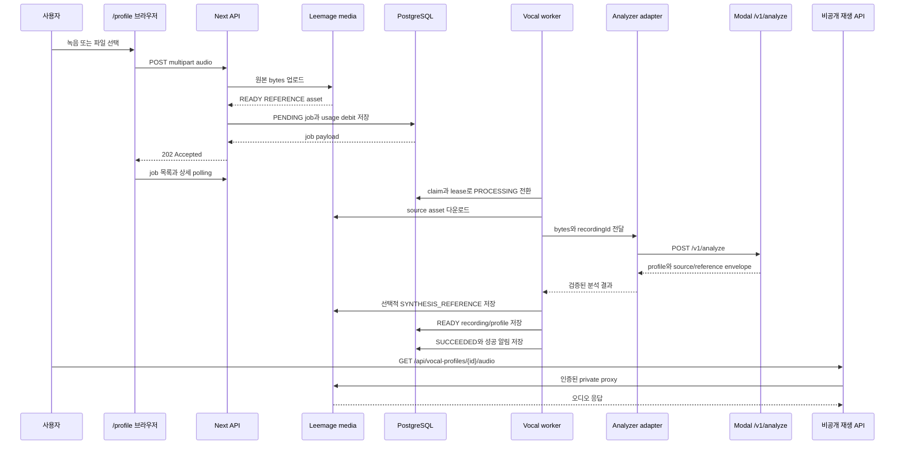

# 보컬 프로필 생성·분석·히스토리 workflow

사용자가 `/profile`에서 녹음하거나 오디오 파일을 고르면 서버는 분석을 즉시 실행하지 않는다. 인증된 API가 bounded multipart를 읽어 원본을 `REFERENCE` media asset으로 저장하고 `VocalProfileAnalysisJob`을 `PENDING`으로 만든 뒤 `202`를 반환한다. worker가 lease를 획득하고 Modal의 동기 analyzer를 호출한 다음, 결과를 `Recording`과 `VocalProfile`로 영속화한다.

이 페이지는 현재 구현의 경계를 설명한다. 추천 로직은 [보컬 분석과 추천](/openwiki/concepts/vocal-analysis-and-recommendations.md), Modal·Leemage 설정은 [외부 서비스](/openwiki/integrations/external-services.md), worker 운영은 [job processing](/openwiki/operations/job-processing.md)을 참고한다.

## 전체 흐름



그림은 앱 DB가 job lifecycle을 소유하고 Modal은 한 HTTP 요청 안에서 분석하는 경계를 보여준다. 이 흐름에는 외부 Modal job ID나 외부 job polling이 없다.

## 브라우저 입력과 서버 계약은 분리된다

`VocalProfileRecorder`는 표현과 장치 수명을 담당한다. `MediaRecorder`가 없으면 `unsupported`, 권한 거부·장치 없음·기타 오류를 별도 상태로 보여주고, `startMic` 후 `startRecording`을 호출한다. 100ms 단위 progress로 시간을 표시하며 자동 종료 상한은 60초다. 취소와 unmount 때 `stopMic`과 plugin `destroy`를 실행한다. `VoiceSignalCore`는 녹음 중 `MediaStream`을 Web Audio `AnalyserNode`로 시각화한다. recorder 자체는 waveform 데이터를 만들지 않는다.

서버 domain contract는 브라우저의 파형·애니메이션·차트가 아니라 `File`, MIME, byte size, recording ID, 분석 결과와 job 상태다. 화면은 `pending`, `processing`, 재시도 중인 오류, 네트워크 재연결, `failed`를 durable job 응답으로 표현하며 가짜 진행률을 만들지 않는다. 성공하면 저장된 `/vocal-profiles/{profileId}`로 이동한다.

녹음과 파일 업로드 모두 분석 가능한 최소 길이는 5초이고 10초를 권장한다. 업로드 준비 단계는 codec padding을 고려해 60초 경계보다 짧은 59.75초까지 자를 수 있다. 사용자가 선택한 음성이 60초를 초과할 때만 trim 동의가 필요하며, analyzer가 받은 실제 decoded audio가 60초를 넘으면 `TOO_LONG`으로 거부한다.

## 업로드 admission과 source asset

진입점은 두 개지만 enqueue 구현은 하나다.

- `POST /api/vocal-profile-analysis-jobs`: job 제출과 인증된 사용자의 job 목록·ticket policy 조회.
- `POST /api/vocal-profiles`: 호환 제출 진입점이며 `GET`은 사용자 profile history를 반환.

두 POST는 세션과 `audio` multipart `File`을 요구한다. 요청 body는 `readBoundedMultipartFormData`와 `multipartBodyLimit`으로 먼저 제한하고, MIME은 WAV, MP3, M4A, WebM 계열만 허용한다. 파일은 비어 있지 않고 25 MB 이하여야 한다. 실패는 대체로 `400 INVALID_UPLOAD`, `415 UNSUPPORTED_AUDIO`, `413 PAYLOAD_TOO_LARGE`이며, 인증되지 않으면 unauthorized response다.

`Idempotency-Key`는 analysis-job 라우트에서 필수이며 공백 제거 후 최대 200자다. enqueue는 다음 순서를 지킨다.

1. 같은 사용자와 key의 job이 있으면 기존 job을 그대로 반환한다. 새 media 업로드와 ticket 차감은 하지 않는다.
2. 사용자에게 `PENDING` 또는 `PROCESSING` job이 있으면 `409 ANALYSIS_BUSY`다. profile 개수는 admission 제한이 아니다.
3. `VOCAL_ANALYSIS` wallet의 balance와 현재 cost를 확인한다. 부족하면 `402 INSUFFICIENT_ANALYSIS_TICKETS`로 끝나며 asset과 job을 만들지 않는다.
4. 원본 bytes를 Leemage에 업로드하고 `MediaAsset(kind: REFERENCE, status: READY)`를 만든다. 이 asset이 분석 source의 durable 사본이다.
5. Serializable transaction에서 idempotency와 active job을 다시 확인하고 job을 만든다. transaction에는 `recordingId`, `sourceAssetId`, `ticketCost`, `maxAttempts`가 저장된다.
6. 비용이 양수면 같은 transaction에 idempotent `USAGE_DEBIT` ledger를 기록한다. write conflict는 최대 세 번 재시도한다.

경쟁 요청이 먼저 job을 만들면 임시 asset을 폐기하고 기존 job을 반환한다. enqueue가 실패해도 임시 asset을 폐기한다. 즉 분석 source를 먼저 외부 media에 저장하되, job 생성 실패로 고아 파일을 남기지 않는다.

## worker lease와 분석 호출

`pnpm worker:vocal-profile-analysis`가 runner를 시작한다. concurrency는 `VOCAL_PROFILE_ANALYSIS_WORKER_CONCURRENCY`로 정하고 기본값은 1, 허용 범위는 1–16이다. lane은 process ID·lane 번호·UUID를 합친 owner를 사용한다. 각 반복은 미처리 환불을 최대 10건 조정하고 job을 하나 처리한다. 처리할 job이 없으면 1초 쉰다. SIGINT/SIGTERM은 새 반복을 멈추고 현재 lane의 작업을 기다린다.

claim은 PostgreSQL transaction의 `FOR UPDATE SKIP LOCKED`로 가장 오래된 후보를 고른다. `attempts < maxAttempts`, `nextAttemptAt <= now`이고 `PENDING`이거나 만료된 `PROCESSING`이어야 한다. claim 시 `PROCESSING`, `leaseOwner`, `leaseExpiresAt`, `heartbeatAt`, `startedAt`을 기록하고 attempts를 증가시킨다. lease 기본값은 300초이며 `VOCAL_PROFILE_ANALYSIS_LEASE_SECONDS`로 180–3,600초 범위에서 설정한다. 별도 heartbeat loop는 없으므로 긴 실행이나 프로세스 사망 뒤 lease가 만료되면 다른 worker가 재처리할 수 있다.

worker는 먼저 같은 사용자와 `recordingId`의 profile을 찾는다. 이미 있으면 분석을 반복하지 않고 job을 성공 처리한다. 없으면 소유자·`REFERENCE`·`READY` 조건을 만족하는 source asset을 확인하고, 외부 URL을 `cache: no-store`와 60초 timeout으로 읽는다. source 다운로드의 429와 5xx는 retryable이고 나머지는 실패다. adapter에 원본 bytes, MIME, filename, recording ID를 전달한다.

## analyzer adapter와 품질 gate

앱 adapter는 `VOCAL_PROFILE_MODAL_URL`과 `VOCAL_PROFILE_MODAL_API_KEY`(또는 `MODAL_API_KEY`)를 요구한다. `${url}/v1/analyze`에 `POST`하고 `Content-Type`, `X-Recording-ID`, `X-API-Key`를 보낸다. timeout은 120초다. 401/403은 `ANALYZER_AUTH_FAILED`(비재시도), 429는 `ANALYZER_BUSY`, 5xx는 `ANALYZER_UNAVAILABLE`, timeout은 `ANALYZER_TIMEOUT`으로 매핑한다.

Modal endpoint는 API key를 검증하고 upload를 1 MiB chunk로 임시 디렉터리에 쓰면서 25 MB를 다시 제한한다. `librosa-pyin` 기반 분석 후 profile과 artifact를 `modal-analysis-envelope-v1` JSON envelope으로 반환하고, 임시 디렉터리 cleanup을 끝낸 뒤 `cleanupConfirmed: true`를 표시한다. Modal 배포는 GPU 없이 CPU 2개·메모리 4096 MiB, 최대 10 container, container당 동시 입력 1개로 설정되어 있다.

analyzer core의 기본 profile 분석 gate는 다음과 같다.

| gate | 현재 기준 | 실패 코드 |
| --- | --- | --- |
| decoded duration | 5초 이상, 60초 이하 | `TOO_SHORT`, `TOO_LONG` |
| 음량 | RMS -45 dB 이상 | `TOO_SILENT` |
| clipping | clipping ratio 1% 이하 | `EXCESSIVE_CLIPPING` |
| 명확한 pitch | voiced ratio 25% 이상 | `LOW_VOICED_RATIO` |
| 입력 구조 | mono, non-empty | `UNSUPPORTED_AUDIO` |

분석 결과에는 pitch 범위와 tessitura, median, voiced ratio, pitch stability, clipping ratio, RMS, analyzer/version, pitch histogram과 최대 720점 pitch track이 들어간다. 구간을 전달하면 guide preset(`low`, `medium`, `high`)과 melody/glissando timestamp를 검증하고, 두 구간 각각 최소 20개의 유효 voiced frame이 필요하다.

adapter는 응답의 recording ID, transport version, cleanup flag, source/reference의 filename·MIME·크기·SHA-256·base64 bytes를 검증한다. worker는 source artifact를 queued source와 byte length·MIME·SHA-256으로 다시 비교한다. 불일치는 `ANALYZER_SOURCE_MISMATCH`로 즉시 terminal failure가 된다. 이 검증 때문에 외부 analyzer가 다른 파일을 분석한 결과를 사용자 source에 연결할 수 없다.

## source와 reference의 수명 및 저장

용어를 구분해야 한다.

- **analysis source**: 사용자가 올린 원본이다. enqueue 때 `REFERENCE` asset으로 먼저 저장하고, 성공 후 `USER_TEST` `Recording`에 연결한다. profile 상세의 기본 오디오다.
- **smart synthesis reference**: analyzer가 선택적으로 만든 별도 artifact다. 있으면 `SYNTHESIS_REFERENCE` asset으로 저장하고 profile에 연결한다. source를 대체하는 필수 결과가 아니다.
- **analysis reference bands**: analyzer core가 pitch 후보를 low/mid/high band로 설명하는 descriptor다. 현재 smart synthesis selection은 mid 후보를 최대 30초, 최소 후보 0.5초 단위로 선택하며 후보 자체는 최대 4초다. 분석용 band allocation은 band별 10초 목표를 사용한다.

`persistQueuedAnalyzedVocalProfile`은 queued source의 사용자·kind·status·MIME·크기를 재확인한다. smart synthesis reference 저장이 실패하면 source fallback을 남기고 profile 저장은 계속한다. source 저장 또는 profile transaction이 실패하면 생성한 asset을 정리하고 retryable persistence error를 반환한다.

profile 저장 transaction은 사용자별 profile number를 원자적으로 할당하고 `sourceType: USER`, pitch metrics, quality metrics, descriptors, analyzer/version을 저장한다. `Recording(kind: USER_TEST, status: READY)`에는 duration, size, sample rate와 `leemage://...` storage path가 들어가며 source media asset과 연결된다. 동시 실행으로 같은 recording profile이 먼저 생기면 기존 profile을 반환해 중복을 피한다. 성공 시 job에 profile ID를 연결하고 lease를 해제한다.

## 실패, 재시도, 환불

retryable 오류이고 attempts가 남아 있으면 job은 `PENDING`으로 돌아간다. source asset은 유지하고 `errorCode`, 최대 2,000자의 `errorDetail`, `retryable: true`, `nextAttemptAt`을 저장한다. delay는 `min(30, 2 ** (attempts - 1))`초다. Modal unavailable/busy/timeout, source 429·5xx, 일시적인 profile 저장 오류가 이 경로에 속한다. terminal notification은 재시도 중 만들지 않는다.

비재시도 오류이거나 최대 시도 횟수에 도달하면 다음 순서다.

1. job을 `FAILED`로 만들고 오류·완료 시각을 기록하며 `sourceAssetId`를 null로 detach한다.
2. `VOCAL_PROFILE_FAILED` notification을 transaction 안에서 만들고 `/library?tab=profiles`로 연결한다.
3. 기존 source asset을 삭제한다. 외부 삭제 실패 시 `DELETE_PENDING` asset과 후속 `mediaCleanupJob`을 만든다.
4. ticket cost가 양수면 `refundState: REQUIRED`로 두고 `vocal-analysis-refund:{job.id}` key의 `USAGE_REFUND`를 적용한다. 성공하면 `REFUNDED`다.

환불이 실패해도 FAILED job과 실패 알림은 이미 남는다. runner는 매 반복 시작에 `REQUIRED` 환불을 최대 10건 보상 처리하므로 운영자는 job status, refundState, media cleanup 상태를 함께 확인해야 한다.

## 히스토리와 비공개 재생

`GET /api/vocal-profiles`는 현재 사용자이며 `sourceType: USER`인 profile만 최신순으로 반환한다. 기본 page size는 12, 최대 50이고 summary에는 range/tessitura, quality metrics, recording duration·MIME, mixing count, 생성 시각이 포함된다. 상세 조회도 user ownership과 `sourceType: USER`를 검사하고 profile, recording, mixing count, `/api/vocal-profiles/{id}/audio` URL을 반환한다.

오디오 URL은 public Leemage URL을 화면에 직접 노출하는 링크가 아니다. audio route는 세션을 요구하고, profile recording에 연결된 asset이 같은 사용자·`REFERENCE`·`READY`인지 확인한 뒤 `proxyPrivateAudio`로 외부 응답을 중계한다. synthesis reference도 별도 route에서 같은 ownership·kind·status 조건을 검사한다. asset이 없거나 조건을 만족하지 않으면 404, proxy 실패는 502다.

## 변경 시 확인할 테스트

```bash
pnpm exec tsx --test tests/long-audio-upload.test.ts tests/profile-audio-preparation.test.ts tests/voice-scan-state.test.ts
pnpm exec tsx --test tests/vocal-profile-analysis-queue.integration.ts
pnpm exec tsx --test tests/vocal-profile-history.integration.ts
pnpm exec vitest run tests/private-audio-proxy.test.ts
```

- `long-audio-upload.test.ts`, `profile-audio-preparation.test.ts`: 60초 초과 판정과 59.75초 codec headroom을 고정한다.
- `voice-scan-state.test.ts`: 5초 최소·10초 권장, recorder 오류 분류, durable job 상태 표현, media cleanup과 성공 redirect를 확인한다.
- `vocal-profile-analysis-queue.integration.ts`: idempotency, active job 단일성, ticket admission/debit, lease 만료, source 재사용, transient retry, terminal cleanup·환불·알림을 검증한다.
- `vocal-profile-history.integration.ts`, `private-audio-proxy.test.ts`: 사용자별 history와 private audio ownership/proxy 경계를 검증한다.
- analyzer core 및 Modal adapter 테스트는 `TOO_LONG`, 품질 gate, segmented analysis, envelope/artifact 무결성, timeout·HTTP 오류 매핑, cleanup contract를 함께 확인해야 한다.

worker를 확장할 때는 Modal 외부 job lifecycle을 새로 가정하지 말고 앱 DB의 `PENDING → PROCESSING → SUCCEEDED/FAILED` 전이와 lease를 유지한다. 브라우저 waveform이나 chart를 바꿀 때는 server domain contract와 분리된 UI 변경인지 먼저 확인한다.
